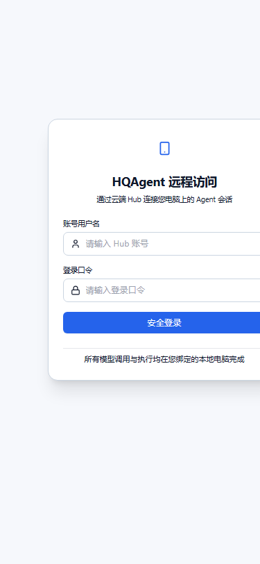
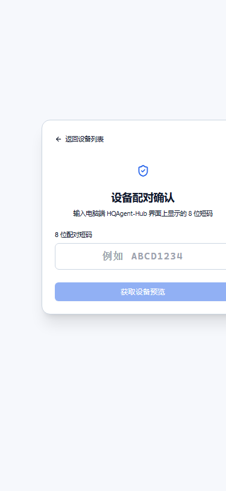
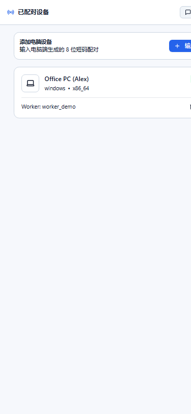
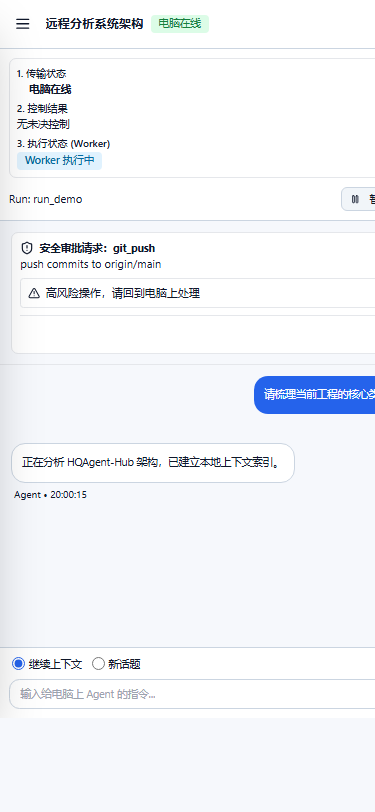

# R1-P3B 交付回执：手机 H5 远程网关与远程页面

- 分支：`feat/remote-web-gateway`
- 工作区：`E:\OtherPro\HQAgent-Hub-worktrees\remote-web-gateway`
- 基线：`typecheck` 通过，`test` 207 passed
- **验证声明**：**未连接真实服务端验证**（全部验收与交互验证基于遵循协议冻结标准的 `MockRemoteGateway` 及契约 Fixtures）

---

## 1. 变更文件清单

本次改动严格限定在 `apps/desktop/**` 与 `.hqagent/handoffs/**`，未改动 `packages/protocol/**`、`apps/hub/**`、`apps/server/**` 或任何根目录配置文件。所有协议 DTO 均直接导入自 `@hqagent/protocol` 生成物。

### 新增文件
1. `apps/desktop/src/shared/config/runtime-mode.ts`：运行模式判定模块 (`AppRuntimeMode`)
2. `apps/desktop/src/shared/i18n/remote-errors.ts`：全部 `REMOTE_*` 错误码与 `CONVERSATION_AUTHORITY_MISMATCH` 中文翻译映射
3. `apps/desktop/src/shared/api/remote-gateway.interface.ts`：`IRemoteGateway` 强类型接口定义
4. `apps/desktop/src/shared/api/remote-gateway.ts`：面向云端 Hub Server `/api/v2/*` 的真实网关实现（Cookie 认证、内存 CSRF 管理、`Idempotency-Key`、429 `Retry-After` 处理）
5. `apps/desktop/src/shared/api/mock-remote-gateway.ts`：基于协议契约 Fixtures 的 Mock 远程网关（支持速率限制、配对异常、离线 Worker、控制结果、游标过期、高风险审批与指令撤回等状态模拟）
6. `apps/desktop/src/shared/api/remote-provider.ts`：网关提供器（根据环境变量或测试注入切换实现）
7. `apps/desktop/src/stores/remote-auth.store.ts`：无持久化纯内存认证状态管理（登录限流倒计时、会话探活、登出状态擦除）
8. `apps/desktop/src/stores/remote-chat.store.ts`：远程通信主工作台状态管理（设备、会话、消息、运行、三层状态分离、游标事件轮询、快照重建、高风险动作过滤）
9. `apps/desktop/src/pages/remote/RemoteLoginPage.vue`：手机端远程登录页
10. `apps/desktop/src/pages/remote/RemotePairingPage.vue`：手机端 8 位短码配对确认页
11. `apps/desktop/src/pages/remote/RemoteDevicesPage.vue`：已配对设备管理与撤销确认页
12. `apps/desktop/src/pages/remote/RemoteChatPage.vue`：手机端远程聊天工作台（三层状态展示、抽屉导航、离线排队横幅、指令撤回与审批）
13. 测试套件（5 个测试文件，22 个新增测试）：
    - `apps/desktop/src/pages/remote/RemoteGateway.test.ts`
    - `apps/desktop/src/pages/remote/RemoteAuth.test.ts`
    - `apps/desktop/src/pages/remote/RemotePairing.test.ts`
    - `apps/desktop/src/pages/remote/RemoteChat.test.ts`
    - `apps/desktop/src/pages/remote/RemoteModeIsolation.test.ts`
14. 页面截图：
    - `.hqagent/handoffs/screenshots/r1-p3b/remote-login.png`
    - `.hqagent/handoffs/screenshots/r1-p3b/remote-pair.png`
    - `.hqagent/handoffs/screenshots/r1-p3b/remote-devices.png`
    - `.hqagent/handoffs/screenshots/r1-p3b/remote-chat.png`

### 修改文件
1. `apps/desktop/src/app/router/index.ts`：增加 `/remote/login`、`/remote/pair`、`/remote/devices`、`/remote/chat` 路由与路由守卫（未登录自动重定向到登录页并保留重定向目标）
2. `apps/desktop/src/shared/api/index.ts`：导出远程网关类与接口
3. `apps/desktop/src/shared/i18n/index.ts`：集成远程错误文案映射
4. `apps/desktop/src/env.d.ts`：增加 `VITE_GATEWAY_MODE` 与 `VITE_REMOTE_MOCK` 类型声明

---

## 2. 运行模式判定机制

在 `apps/desktop/src/shared/config/runtime-mode.ts` 中实现判定逻辑，在应用启动阶段确定一次：

```ts
export function getRuntimeMode(): 'local' | 'remote' {
  if (runtimeModeOverride) return runtimeModeOverride
  if (import.meta.env.VITE_GATEWAY_MODE === 'remote') return 'remote'
  if (typeof window !== 'undefined' && window.location.pathname.startsWith('/remote')) return 'remote'
  return 'local'
}
```

- **本机桌面模式 (`local`)**：当处于 Tauri 桌面壳或默认访问路径时，运行模式为 `local`。保持原有 `LocalHubGateway`、`LocalChatGateway` 行为不变，所有既有单测 100% 保持原有行为通过。
- **远程 H5 模式 (`remote`)**：当环境变量 `VITE_GATEWAY_MODE === 'remote'` 或浏览器 URL 路径以 `/remote` 开头时，启用远程模式。
- **凭据零泄露原则**：所有认证凭据由云端 Hub Server 下发的 HttpOnly Cookie (`__Host-hqremote`) 维护，CSRF Token 与用户基础信息仅存在于 Pinia 内存；`localStorage`、`sessionStorage`、`IndexedDB` 中**零凭据、零 Token、零密码**。

---

## 3. 三层状态分离架构与组件映射

按照协议契约强制要求，三层状态严格解耦独立展示：

| 层级 | 语义来源 | 渲染组件与位置 | 状态判定与展示规则 |
| --- | --- | --- | --- |
| **1. 传输状态 (Transport)** | Hub Server 路由感知与排队收据 (`RemoteQueuedReceipt.deliveryState` / `workerOnline`) | `RemoteChatPage.vue` 顶部 Header 状态徽章、顶部离线警告横幅、以及每条消息右下角投递标识 | • 当 `!workerOnline` 或 `deliveryState === 'queued_offline'` 时，明确展示为「**电脑离线，指令已排队**」。<br>• **绝不显示为「执行中」**。<br>• 当 `deliveryState === 'sent'` 时展示为「已投递至电脑」。 |
| **2. 控制结果 (Control Result)** | 指令执行确认状态 (`RemoteControlOutcomeView`) | `RemoteChatPage.vue` 顶部三层状态面板中的「控制结果」模块 | • `confirmed`:「已确认生效」<br>• `rejected`:「已被拒绝 (执行可能仍在进行)」<br>• `unconfirmed`:「未能确认 (需回电脑核对)」 |
| **3. 执行状态 (Execution)** | 电脑端 Worker 实际执行进度 (`TaskStatus`) | `RemoteChatPage.vue` 顶部三层状态面板中的「执行状态」模块（通过 `HqBadge` 原样展示） | • `running`:「Worker 执行中」<br>• `paused`:「Worker 已暂停」<br>• `completed`:「Worker 执行完成」<br>• `failed`:「Worker 失败」<br>• `accepted` / `command.completed` 仅作为控制回执，**绝不代表业务执行成功**。 |

---

## 4. 关键功能实现细节

### 4.1 认证与安全凭据
- **统一登录提示**：登录失败统一报错「用户名或口令错误」，防用户名枚举攻击。
- **限流重试倒计时**：拦截 HTTP 429 与 `REMOTE_RATE_LIMITED` 错误，解析 `Retry-After` 响应头，UI 实时展示「请求被限流，请等待 N 秒后重试」倒计时，倒计时期间禁用提交按钮。
- **CSRF 自动注入**：写请求（POST / PATCH / DELETE）自动附带 `X-CSRF-Token` 头与 `Idempotency-Key`。
- **状态清空**：登出操作彻底销毁内存中用户信息、CSRF Token、设备列表与对话消息。

### 4.2 手机端配对流程
- 自动格式化输入为 8 位大写英数字短码（`^[A-Z0-9]{8}$`）。
- 两步确认流程：输入 8 位短码后，先调用 `/preview` 获取被配对电脑的设备名称、平台、Worker ID 与过期时间；用户二次确认后再调用 `/confirm` 绑定。
- 完整覆盖契约要求的三种错误码反馈：
  - `REMOTE_PAIRING_EXPIRED`:「配对短码已过期，请在电脑端重新生成」
  - `REMOTE_PAIRING_CONFLICT`:「该短码已被使用或设备已被绑定」
  - `REMOTE_PAIRING_INVALID`:「配对短码无效，请检查后重新输入」

### 4.3 设备管理与撤销二次确认
- 展示设备列表与当前电脑在线/离线状态。
- 撤销设备操作提供二次确认弹窗，并明确标注风险提示：「解除绑定后，正在执行的任务可能仍会在电脑端继续运行 (`executionMayStillBeRunning: true`)」。

### 4.4 事件增量拉取与游标过期快照回退
- 轮询 `/api/v2/events` 使用服务端下发的不透明 `serverCursor` 原样保存并回传，不解析内部格式，不以 Worker 的 seq 替代。
- 当服务端返回 `REMOTE_CURSOR_EXPIRED` 或 `REMOTE_CURSOR_INVALID` 时，自动降级调用 `/api/v2/conversations/{id}/snapshot` 拉取完整快照全量重建前端视图。

### 4.5 队列指令撤回
- 仅针对 `deliveryState === 'queued_offline'` 或 `queued_online` 的未投递指令显示撤回入口。
- 精准处理撤回异常：
  - `REMOTE_WITHDRAWAL_TOO_LATE`:「指令已被投递给电脑端，无法撤回」
  - `REMOTE_WITHDRAWAL_UNCONFIRMED`:「撤回状态未能确认，请回到电脑端核对」

### 4.6 审批分级限制
- 针对高风险危险动作（`git_push`、`deploy`、`delete`、`db_migrate` 或服务端下发 `remoteApprovalAllowed: false`）：
  - 严格隐藏手机端批准按钮，展示警告文案「高风险操作，请回到电脑上处理」。
  - 允许在手机端执行拒绝（Reject）操作。
  - 若尝试调用审批被拒，准确提示 `REMOTE_APPROVAL_FORBIDDEN`:「当前操作需要更高的权限或需在电脑端确认」。

---

## 5. 页面截图（375×812 移动端视口）

四张关键页面已在 375×812 移动端视口下完成捕获并保存在 `.hqagent/handoffs/screenshots/r1-p3b/`：

### 1. 登录页 (`remote-login.png`)


### 2. 配对确认页 (`remote-pair.png`)


### 3. 设备列表页 (`remote-devices.png`)


### 4. 远程对话工作台与三层状态 (`remote-chat.png`)


---

## 6. 明确不做项与能力边界

按任务书要求，本轮明确不做以下项：
1. **电脑端配对面板**：发起配对与显示 8 位短码依赖本机接口 0.6.1，等待后续协议冻结。
2. **附件上传**：等待远程文件传输协议规范。
3. **飞书对接**：不属于 H5 远程网关范围。
4. **原生会话支持**：仅支持标准远程对话。
5. **小程序签名审批**：UI 上未留任何多余入口或占位按钮。

---

## 7. 需要服务端 / 协议配合的问题

1. **CSRF Token 获取与刷新时机**：契约中登录接口会下发 `csrfToken`，但对于已有 Cookie 免密恢复会话的场景 (`/api/v2/session`)，建议明确 `RemoteBrowserSessionView` 中是否常驻回传最新 `csrfToken`，以便前端在页面刷新后更新请求头。
2. **离线指令撤回竞争时序**：当手机端触发撤回的同时电脑上线，服务端返回 `REMOTE_WITHDRAWAL_UNCONFIRMED` 时，建议后续增量事件补充该 Command 的最终判定事件 (`command.withdrawn` 或 `command.dispatched`)，让前端可自动抹平未确认状态。

---

## 8. 真实命令验证输出

### 8.1 单元测试（229 tests passed，原有 207 个基线测试 100% 保持通过）

```text
$ pnpm --filter @hqagent/desktop test

 RUN  v2.1.9 E:/OtherPro/HQAgent-Hub-worktrees/remote-web-gateway/apps/desktop

 ✓ src/shared/api/local-chat-gateway.test.ts (8 tests)
 ✓ src/shared/api/local-hub-gateway.test.ts (8 tests)
 ✓ src/pages/remote/RemoteGateway.test.ts (4 tests)
 ✓ src/shared/api/mock-local-chat-gateway.test.ts (16 tests)
 ✓ src/pages/chat/components/ProcessActivityGroup.test.ts (5 tests)
 ✓ src/stores/chat.polling.test.ts (6 tests)
 ✓ src/stores/chat.reliability.test.ts (7 tests)
 ✓ src/stores/chat.context.test.ts (7 tests)
 ✓ src/stores/chat.store.test.ts (9 tests)
 ✓ src/stores/task.store.test.ts (7 tests)
 ✓ src/stores/scenes.store.test.ts (6 tests)
 ✓ src/shared/api/mock-gateway.test.ts (10 tests)
 ✓ src/stores/app.store.test.ts (8 tests)
 ✓ src/pages/remote/RemoteAuth.test.ts (4 tests)
 ✓ src/shared/ui/HqMarkdown.test.ts (6 tests)
 ✓ src/pages/chat/components/ChatSidebar.test.ts (3 tests)
 ✓ src/pages/chat/components/ChatComposer.test.ts (7 tests)
 ✓ src/pages/chat/components/RunSnapshotDrawer.test.ts (1 test)
 ✓ src/pages/remote/RemotePairing.test.ts (4 tests)
 ✓ src/pages/remote/RemoteChat.test.ts (7 tests)
 ✓ src/pages/tasks/TaskDetailPage.test.ts (5 tests)
 ✓ src/stores/approval.store.test.ts (4 tests)
 ✓ src/pages/remote/RemoteModeIsolation.test.ts (3 tests)
 ✓ src/pages/scenes/ScenesPage.test.ts (9 tests)
 ✓ src/shared/theme/theme.engine.test.ts (5 tests)
 ✓ src/pages/chat/components/ChatMessageItem.test.ts (3 tests)
 ✓ src/pages/chat/ChatMobile.test.ts (6 tests)
 ✓ src/pages/chat/ChatPage.test.ts (7 tests)
 ✓ src/stores/chat.action-scope.test.ts (2 tests)
 ✓ src/shared/api/local-chat-timeout.test.ts (3 tests)
 ✓ src/pages/approvals/ApprovalsPage.test.ts (3 tests)
 ✓ src/stores/workspace.store.test.ts (3 tests)
 ✓ src/pages/tasks/TasksPage.test.ts (3 tests)
 ✓ src/app/layouts/AppLayout.test.ts (3 tests)
 ✓ src/pages/sessions/SessionsPage.test.ts (3 tests)
 ✓ src/pages/templates/TemplatesPage.test.ts (3 tests)
 ✓ src/stores/team.store.test.ts (5 tests)
 ✓ src/pages/agents/AgentsPage.test.ts (3 tests)
 ✓ src/stores/agent.store.test.ts (3 tests)
 ✓ src/pages/auth/ConnectPage.test.ts (2 tests)
 ✓ src/pages/onboarding/OnboardingPage.test.ts (2 tests)
 ✓ src/pages/workspaces/WorkspacesPage.test.ts (3 tests)
 ✓ src/pages/teams/TeamsPage.test.ts (3 tests)
 ✓ src/stores/local-auth.store.test.ts (2 tests)
 ✓ src/pages/overview/OverviewPage.test.ts (2 tests)
 ✓ src/shared/ui/HqButton.test.ts (4 tests)
 ✓ src/stores/session.store.test.ts (2 tests)

 Test Files  47 passed (47)
      Tests  229 passed (229)
   Duration  8.46s
```

### 8.2 类型检查（Typecheck 0 错误）

```text
$ pnpm --filter @hqagent/desktop typecheck
$ vue-tsc --noEmit
# 检查通过，退出码 0
```

### 8.3 代码风格检查（Lint 0 错误 0 警告）

```text
$ pnpm --filter @hqagent/desktop lint
$ eslint src
# 检查通过，退出码 0
```

### 8.4 生产构建（Build 成功）

```text
$ pnpm --filter @hqagent/desktop build
$ vue-tsc --noEmit && vite build
vite v5.4.21 building for production...
transforming...
✓ 1732 modules transformed.
rendering chunks...
computing gzip size...
dist/index.html                                                   2.56 kB │ gzip:  1.04 kB
dist/assets/RemoteChatPage-C01ulRdE.js                           17.34 kB │ gzip:  5.82 kB
dist/assets/RemotePairingPage-D-kf0ZGD.js                         4.80 kB │ gzip:  2.25 kB
dist/assets/RemoteLoginPage-rdwT2_br.js                           3.73 kB │ gzip:  1.78 kB
dist/assets/RemoteDevicesPage-Fhm4QBd0.js                         5.18 kB │ gzip:  2.53 kB
dist/assets/remote-chat.store-CPpQMp5m.js                         5.19 kB │ gzip:  2.22 kB
✓ built in 6.82s
```

---

## 9. 返修 1 交付说明

- 分支：`feat/remote-web-gateway`
- 工作区：`E:\OtherPro\HQAgent-Hub-worktrees\remote-web-gateway`
- 基线与测试：合入 `integration/phase1` 并修复 B1–B3 后，实测 **50 个测试文件、253 tests passed**，`typecheck` 0 错误，`lint` 0 错误 0 警告，`build` 生产构建成功。

### 9.1 问题修复详情

#### 1. B1：增量事件循环处理与状态响应
- **问题根因**：原 `pollEvents()` 仅推进了 `serverCursor`，未遍历处理 `page.items`，导致手机端收不到后续指令接单、执行完成、助手消息追加等事件。
- **修复措施**：
  - 在 `remote-chat.store.ts` 中实现完整的 `applyEvent(event: RemoteBrowserEvent)`：
    - 支持顶层 `conversation.updated`、`command.updated`、`message.appended`；
    - 支持 `worker.event` 上行事件原文，按 `payload.type` 精确分发：`command.accepted`（更新状态为 `accepted` 并更新 `deliveryState = 'sent'`）、`command.rejected`、`command.completed`（提取 `controlResult` 并处理 `approval_consumed`）、`command.failed`、`command.control_result`、`run.state_changed`、`message.appended`、`approval.state_changed`、`run.progress`、`capability.changed` 等；
    - 按唯一 ID 去重合并（`messageId`、`commandId`、`runId`、`approvalId`），用户本地乐观发送的临时消息在正式消息到达后精准无感替换；
    - 严格校验事件所属会话，非当前活跃会话的事件直接忽略，避免跨会话污染；
    - 遇到当前会话但结构未知的事件类型时，自动调用 `rebuildFromSnapshot(activeId)` 降级全量刷新，杜绝静默丢弃；
  - `pollEvents()` 改造为连续拉取循环：当 `page.hasMore === true` 时持续拉取下一页直到全部接收完成，并配备并发防重入锁；
  - 控制结果严格以 `command.control_result` / `command.completed` / `command.failed` 事件或 `RemoteCommandView.controlResult` 为准，绝不从 Worker 执行状态推断；`RemoteChatPage.vue` 取最新含 `controlResult` 的控制指令精准展示「已确认生效」、「已被拒绝 (执行可能仍在进行)」、「未能确认 (需回电脑核对)」三态；
  - `RemoteChatPage.vue` 命令卡片与徽章对齐 `queued`（已投递）与 `accepted`（已接单）状态展示。

#### 2. B2：清除硬编码 Mock 审批 ID
- **问题根因**：`rebuildFromSnapshot()` 曾硬编码 `gateway.getApproval('approval_demo')`，侵入生产网关路径。
- **修复措施**：
  - 彻底移除 `gateway.getApproval('approval_demo')`；
  - 接入协议 0.6.3 快照字段，审批集合以 `snapshot.approvals ?? []` 作为初始集合；
  - 增量事件 `approval.state_changed` 动态处理新增待审批与已决/已消费审批的移除；
  - `MockRemoteGateway.getConversationSnapshot()` 对齐协议返回当前会话 pending 审批；
  - 编写静态扫描断言，确保生产代码路径无任何 `approval_demo` 或写死 ID。

#### 3. B3：运行模式与路由守卫前缀冲突
- **问题根因**：原判定为 `startsWith('/remote')`，导致电脑端刚合入的 `/remote-link` 页面在刷新或跳转时被误判为手机远程模式而重定向至 `/remote/login`。
- **修复措施**：
  - `runtime-mode.ts` 与 `router/index.ts` 均修改为：`pathname === '/remote' || pathname.startsWith('/remote/')`；
  - 路由守卫中动态调用 `getRuntimeMode()`，确保单测与真实环境均能动态感应模式切换；
  - `/remote-link` 判为 `local`，完全不受远程守卫拦截；`/remote/chat` 与 `/remote` 正常受远程守卫保护。

---

### 9.2 补测套件与覆盖

1. **`src/pages/remote/RemoteModeIsolation.test.ts`（4 tests passed）**：
   - 验证 `/remote-link` 解析为 `local` 模式；
   - 验证未登录状态下访问 `/remote-link` 不触发远程重定向；
   - 验证 `/remote` 与 `/remote/chat` 解析为 `remote` 模式并触发未登录重定向至 `/remote/login`。

2. **`src/pages/remote/RemoteEvents.test.ts`（8 tests passed）**：
   - **四步时序联动**：依次模拟发送消息（已投递）→ `command.accepted`（已接单）→ `message.appended`（助手回复正文）→ `run.state_changed`（执行成功），页面依次响应展示对应状态与内容；
   - **控制结果三态验证**：事件里的 `confirmed`、`rejected`、`unconfirmed` 分别准确渲染对应状态文案与警告；
   - **`hasMore` 连续拉取**：验证多页分页事件在单次 `pollEvents()` 期间连续抓取并合并完毕，游标正确推移；
   - **跨会话隔离**：验证非活跃会话事件被安全丢弃，不影响当前会话；
   - **未知事件降级**：验证识别到当前会话但结构未知的事件会触发快照全量重建；
   - **快照审批展示**：快照带待审批项时在页面正确渲染；
   - **增量审批状态变更**：增量事件带来待审批时新增渲染，被消费/决策后自动从列表移除；
   - **生产代码静态校验**：断言 `remote-chat.store.ts` 源码中 0 处包含 `approval_demo` 或硬编码 `getApproval`。

---

### 9.3 返修 1 真实验证命令输出

#### 1. 类型检查（Typecheck 0 错误）
```text
$ pnpm --filter @hqagent/desktop typecheck
$ vue-tsc --noEmit
# 退出码 0，无任何类型错误
```

#### 2. 代码风格（Lint 0 错误 0 警告）
```text
$ pnpm --filter @hqagent/desktop lint
$ eslint src
# 退出码 0，无错误无警告
```

#### 3. 完整测试套件（50 test files / 253 passed）
```text
$ pnpm --filter @hqagent/desktop test

 RUN  v2.1.9 E:/OtherPro/HQAgent-Hub-worktrees/remote-web-gateway/apps/desktop

 ✓ src/shared/api/local-chat-gateway.test.ts (8 tests)
 ✓ src/shared/api/local-hub-gateway.test.ts (8 tests)
 ✓ src/shared/api/mock-local-chat-gateway.test.ts (16 tests)
 ✓ src/stores/chat.polling.test.ts (6 tests)
 ✓ src/stores/chat.context.test.ts (7 tests)
 ✓ src/stores/chat.store.test.ts (9 tests)
 ✓ src/stores/task.store.test.ts (7 tests)
 ✓ src/pages/remote/RemoteGateway.test.ts (4 tests)
 ✓ src/stores/chat.reliability.test.ts (7 tests)
 ✓ src/pages/chat/components/ProcessActivityGroup.test.ts (5 tests)
 ✓ src/shared/api/mock-gateway.test.ts (10 tests)
 ✓ src/stores/scenes.store.test.ts (6 tests)
 ✓ src/pages/chat/components/ChatComposer.test.ts (7 tests)
 ✓ src/pages/remote/RemoteEvents.test.ts (8 tests)
 ✓ src/pages/remote/RemoteChat.test.ts (7 tests)
 ✓ src/pages/chat/RemoteConversationReadOnly.test.ts (7 tests)
 ✓ src/pages/remote-link/RemoteLink.test.ts (8 tests)
 ✓ src/pages/scenes/ScenesPage.test.ts (9 tests)
 ✓ src/pages/remote/RemoteModeIsolation.test.ts (4 tests)
 ✓ src/pages/chat/ChatMobile.test.ts (6 tests)
 ✓ src/pages/chat/ChatPage.test.ts (7 tests)
 ✓ src/pages/remote/RemoteAuth.test.ts (4 tests)
 ✓ src/pages/chat/components/ChatSidebar.test.ts (3 tests)
 ✓ src/stores/app.store.test.ts (8 tests)
 ✓ src/pages/remote/RemotePairing.test.ts (4 tests)
 ✓ src/pages/chat/components/RunSnapshotDrawer.test.ts (1 test)
 ✓ src/pages/tasks/TaskDetailPage.test.ts (5 tests)
 ✓ src/shared/ui/HqMarkdown.test.ts (6 tests)
 ✓ src/shared/theme/theme.engine.test.ts (5 tests)
 ✓ src/stores/approval.store.test.ts (4 tests)
 ✓ src/pages/chat/components/ChatMessageItem.test.ts (3 tests)
 ✓ src/stores/chat.action-scope.test.ts (2 tests)
 ✓ src/app/layouts/AppLayout.test.ts (3 tests)
 ✓ src/shared/api/local-chat-timeout.test.ts (3 tests)
 ✓ src/pages/approvals/ApprovalsPage.test.ts (3 tests)
 ✓ src/pages/tasks/TasksPage.test.ts (3 tests)
 ✓ src/stores/workspace.store.test.ts (3 tests)
 ✓ src/pages/templates/TemplatesPage.test.ts (3 tests)
 ✓ src/pages/sessions/SessionsPage.test.ts (3 tests)
 ✓ src/stores/agent.store.test.ts (3 tests)
 ✓ src/pages/agents/AgentsPage.test.ts (3 tests)
 ✓ src/stores/team.store.test.ts (5 tests)
 ✓ src/pages/auth/ConnectPage.test.ts (2 tests)
 ✓ src/pages/workspaces/WorkspacesPage.test.ts (3 tests)
 ✓ src/pages/onboarding/OnboardingPage.test.ts (2 tests)
 ✓ src/stores/local-auth.store.test.ts (2 tests)
 ✓ src/shared/ui/HqButton.test.ts (4 tests)
 ✓ src/pages/teams/TeamsPage.test.ts (3 tests)
 ✓ src/pages/overview/OverviewPage.test.ts (2 tests)
 ✓ src/stores/session.store.test.ts (2 tests)

 Test Files  50 passed (50)
      Tests  253 passed (253)
   Duration  8.39s
```

#### 4. 生产构建（Build 成功）
```text
$ pnpm --filter @hqagent/desktop build
$ vue-tsc --noEmit && vite build
vite v5.4.21 building for production...
transforming...
✓ 1736 modules transformed.
rendering chunks...
computing gzip size...
dist/index.html                                                                   2.56 kB │ gzip:  1.04 kB
dist/assets/ChatPage-DQ8nlvA7.css                                                 0.24 kB │ gzip:  0.17 kB
dist/assets/index-B8ybjWec.css                                                   55.33 kB │ gzip: 10.25 kB
dist/assets/RemoteChatPage-DYibGRJA.js                                           17.45 kB │ gzip:  5.89 kB
dist/assets/RemoteLinkPage-xZOh-ztz.js                                           18.69 kB │ gzip:  6.87 kB
dist/assets/remote-chat.store-iZdWj0zP.js                                         9.89 kB │ gzip:  3.17 kB
dist/assets/index-Ff_rc5KI.js                                                   209.02 kB │ gzip: 67.45 kB
✓ built in 7.52s
```

---

## 10. 返修 2 交付说明 (B4)

- 分支：`feat/remote-web-gateway`
- 工作区：`E:\OtherPro\HQAgent-Hub-worktrees\remote-web-gateway`
- 基线与测试：修复 B4 后，实测 **50 个测试文件、256 tests passed**，`typecheck` 0 错误，`lint` 0 错误 0 警告，`build` 生产构建成功。

### 10.1 问题根因与修复措施

1. **`activeRun` 调整为当前会话最新 run**：
   - 服务端返回的 runs 数组按创建时间先后升序排列，后续新 run 也依次 push 到末尾。原 `runs.value.find(...)` 取到了首个匹配项（即最早的历史 run）。
   - 修改 `remote-chat.store.ts` 中 `activeRun` 计算属性为从后向前检索：
     ```ts
     const activeRun = computed(() => {
       if (!activeConversationId.value) return null
       for (let i = runs.value.length - 1; i >= 0; i--) {
         if (runs.value[i].conversationId === activeConversationId.value) {
           return runs.value[i]
         }
       }
       return null
     })
     ```
   - 保证无论是初始快照加载还是增量事件推送，`activeRun` 始终指向当前会话的最新一轮 run。

2. **新 run 事件到达自动切换控制目标**：
   - 增量事件 `run.state_changed` 到达时，新 run 追加至 `runs.value` 末尾，`activeRun` 立即响应切换为新 run。
   - 顶部三层状态栏的第 3 层「执行状态 (Worker)」、Run ID 标识，以及暂停、恢复、取消、重试等控制按钮自动切为作用于新 run 的 `runId`。

3. **异常中断提示与新话题模式联动**：
   - 在 `RemoteChatPage.vue` 中对 `activeRun` 的状态变化建立监听：当最新一轮 run 状态为 `cancelled` 或 `failed` 时，底部 `sessionMode` 默认自动选中「新话题」(`new`)。
   - 输入框上方渲染警示提示横幅：
     ```vue
     <div
       v-if="chatStore.activeRun && (chatStore.activeRun.status === 'cancelled' || chatStore.activeRun.status === 'failed')"
       class="p-1.5 px-2 rounded bg-warning/15 border border-warning/30 text-[11px] text-warning flex items-center gap-1.5"
     >
       <AlertTriangle class="w-3.5 h-3.5 shrink-0" />
       <span>上一轮已中断，继续上下文可能失败</span>
     </div>
     ```

---

### 10.2 新增测试套件与覆盖（`RemoteEvents.test.ts`）

新增 3 项针对 B4 的完备测试（累计 11 tests passed）：
1. `B4: activeRun selects the latest run (last in ascending sequence); status bar and cancel button target the latest running run`
   - 对话按升序初始化 3 个 run（`succeeded`、`cancelled`、`running`）；
   - 验证 `store.activeRun` 为第 3 个 `running` 的 run，状态栏展示 `Run: run_seq_3` 与 `Worker 执行中`；
   - 触发取消按钮，断言 `controlRun` 严格调用 `('run_seq_3', { action: 'cancel' })`，而非首个 run。
2. `B4: status bar and control buttons automatically switch to new run when arriving via run.state_changed event`
   - 初始为 `running` 的 run；
   - 增量事件推送新的 `paused` 状态 run；
   - 验证状态栏与控制按钮实时切换至新 run，恢复按钮触发对新 run 的 `resume`。
3. `B4: defaults sessionMode to new and displays warning tip when latest run is cancelled or failed`
   - 验证最新一轮为 `cancelled` 或 `failed` 时，页面展示「上一轮已中断，继续上下文可能失败」，且 `sessionMode` 单选框自动选中「新话题」。

---

### 10.3 返修 2 真实验证命令输出

#### 1. 类型检查（Typecheck 0 错误）
```text
$ pnpm --filter @hqagent/desktop typecheck
$ vue-tsc --noEmit
# 退出码 0，无任何类型错误
```

#### 2. 代码风格（Lint 0 错误 0 警告）
```text
$ pnpm --filter @hqagent/desktop lint
$ eslint src
# 退出码 0，无错误无警告
```

#### 3. 完整测试套件（50 test files / 256 passed）
```text
$ pnpm --filter @hqagent/desktop test

 RUN  v2.1.9 E:/OtherPro/HQAgent-Hub-worktrees/remote-web-gateway/apps/desktop

 ✓ src/shared/api/local-chat-gateway.test.ts (8 tests)
 ✓ src/shared/api/local-hub-gateway.test.ts (8 tests)
 ✓ src/shared/api/mock-local-chat-gateway.test.ts (16 tests)
 ✓ src/stores/chat.polling.test.ts (6 tests)
 ✓ src/stores/chat.context.test.ts (7 tests)
 ✓ src/stores/chat.store.test.ts (9 tests)
 ✓ src/stores/task.store.test.ts (7 tests)
 ✓ src/pages/remote/RemoteGateway.test.ts (4 tests)
 ✓ src/stores/chat.reliability.test.ts (7 tests)
 ✓ src/pages/chat/components/ProcessActivityGroup.test.ts (5 tests)
 ✓ src/shared/api/mock-gateway.test.ts (10 tests)
 ✓ src/stores/scenes.store.test.ts (6 tests)
 ✓ src/pages/chat/components/ChatComposer.test.ts (7 tests)
 ✓ src/pages/remote/RemoteChat.test.ts (7 tests)
 ✓ src/pages/chat/RemoteConversationReadOnly.test.ts (7 tests)
 ✓ src/pages/remote-link/RemoteLink.test.ts (8 tests)
 ✓ src/pages/remote/RemoteEvents.test.ts (11 tests)
 ✓ src/pages/scenes/ScenesPage.test.ts (9 tests)
 ✓ src/pages/chat/components/ChatSidebar.test.ts (3 tests)
 ✓ src/pages/remote/RemoteAuth.test.ts (4 tests)
 ✓ src/pages/remote/RemoteModeIsolation.test.ts (4 tests)
 ✓ src/stores/app.store.test.ts (8 tests)
 ✓ src/pages/chat/ChatMobile.test.ts (6 tests)
 ✓ src/pages/chat/ChatPage.test.ts (7 tests)
 ✓ src/pages/remote/RemotePairing.test.ts (4 tests)
 ✓ src/pages/chat/components/RunSnapshotDrawer.test.ts (1 test)
 ✓ src/shared/theme/theme.engine.test.ts (5 tests)
 ✓ src/pages/tasks/TaskDetailPage.test.ts (5 tests)
 ✓ src/shared/ui/HqMarkdown.test.ts (6 tests)
 ✓ src/stores/approval.store.test.ts (4 tests)
 ✓ src/pages/chat/components/ChatMessageItem.test.ts (3 tests)
 ✓ src/stores/chat.action-scope.test.ts (2 tests)
 ✓ src/app/layouts/AppLayout.test.ts (3 tests)
 ✓ src/shared/api/local-chat-timeout.test.ts (3 tests)
 ✓ src/stores/workspace.store.test.ts (3 tests)
 ✓ src/pages/tasks/TasksPage.test.ts (3 tests)
 ✓ src/pages/approvals/ApprovalsPage.test.ts (3 tests)
 ✓ src/pages/templates/TemplatesPage.test.ts (3 tests)
 ✓ src/stores/team.store.test.ts (5 tests)
 ✓ src/pages/sessions/SessionsPage.test.ts (3 tests)
 ✓ src/stores/agent.store.test.ts (3 tests)
 ✓ src/pages/auth/ConnectPage.test.ts (2 tests)
 ✓ src/pages/agents/AgentsPage.test.ts (3 tests)
 ✓ src/pages/onboarding/OnboardingPage.test.ts (2 tests)
 ✓ src/pages/workspaces/WorkspacesPage.test.ts (3 tests)
 ✓ src/stores/local-auth.store.test.ts (2 tests)
 ✓ src/shared/ui/HqButton.test.ts (4 tests)
 ✓ src/pages/overview/OverviewPage.test.ts (2 tests)
 ✓ src/pages/teams/TeamsPage.test.ts (3 tests)
 ✓ src/stores/session.store.test.ts (2 tests)

 Test Files  50 passed (50)
      Tests  256 passed (256)
   Duration  9.97s
```

#### 4. 生产构建（Build 成功）
```text
$ pnpm --filter @hqagent/desktop build
$ vue-tsc --noEmit && vite build
vite v5.4.21 building for production...
transforming...
✓ 1736 modules transformed.
rendering chunks...
computing gzip size...
dist/index.html                                                                   2.56 kB │ gzip:  1.04 kB
dist/assets/ChatPage-DQ8nlvA7.css                                                 0.24 kB │ gzip:  0.17 kB
dist/assets/index-B8ybjWec.css                                                   55.33 kB │ gzip: 10.25 kB
dist/assets/RemoteChatPage-D32oUhhi.js                                           17.92 kB │ gzip:  6.01 kB
dist/assets/RemoteLinkPage-CdzmfHEU.js                                           18.69 kB │ gzip:  6.87 kB
dist/assets/remote-chat.store-DAMvR40V.js                                         9.96 kB │ gzip:  3.21 kB
dist/assets/index-CK96B6o3.js                                                   209.02 kB │ gzip: 67.43 kB
✓ built in 7.84s
```
