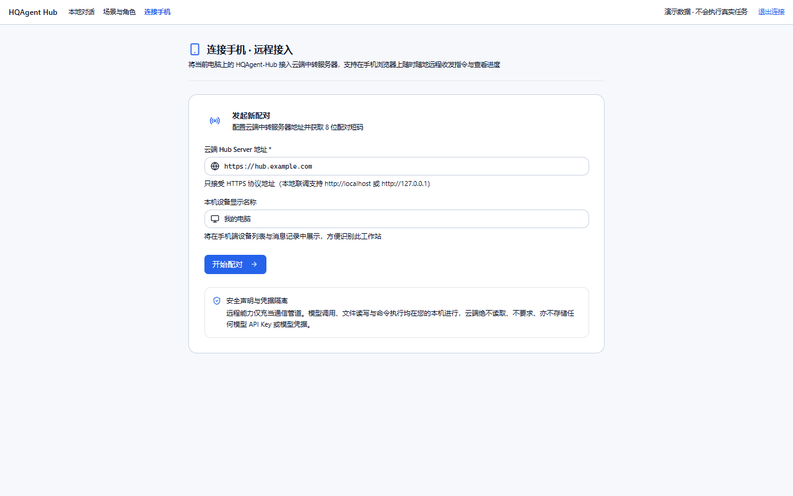
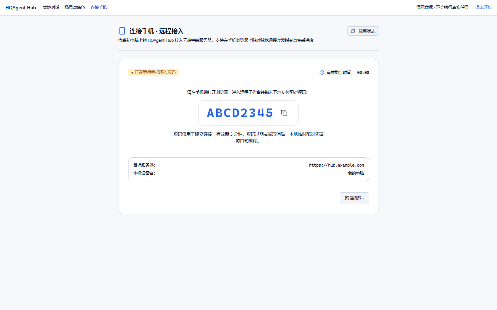
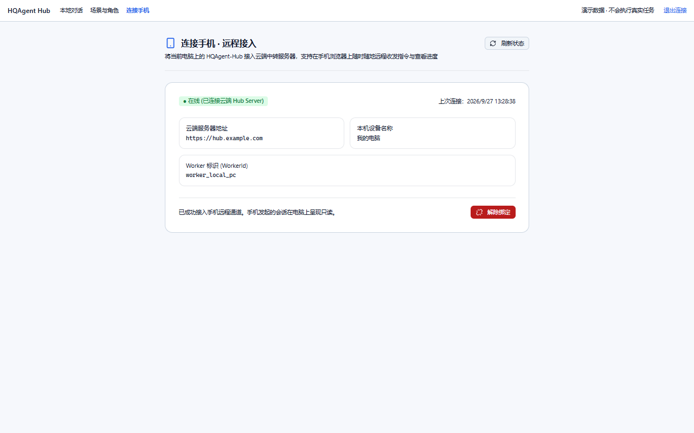
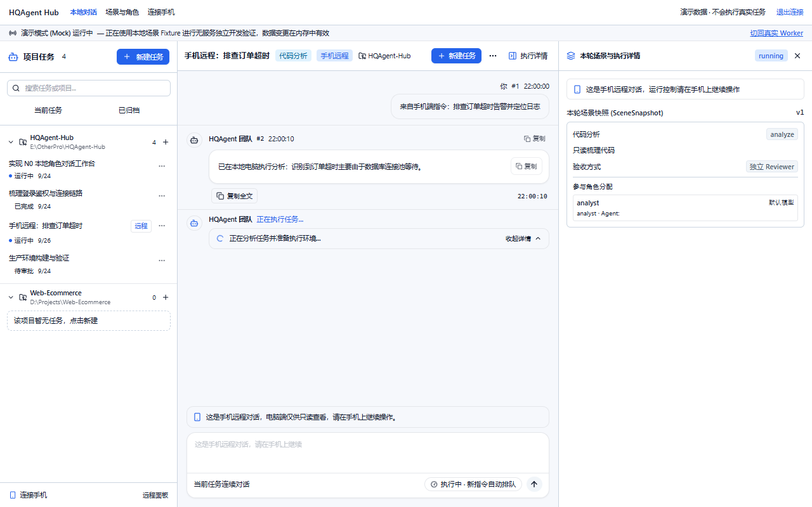
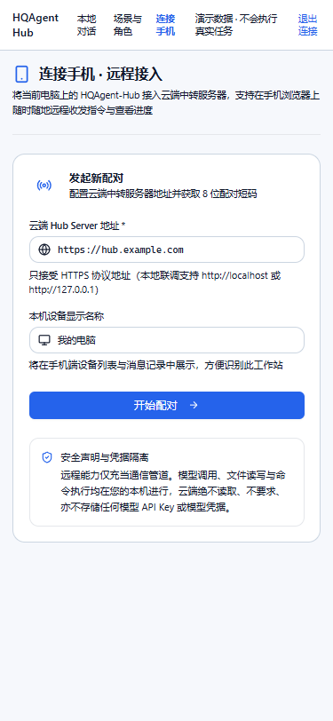
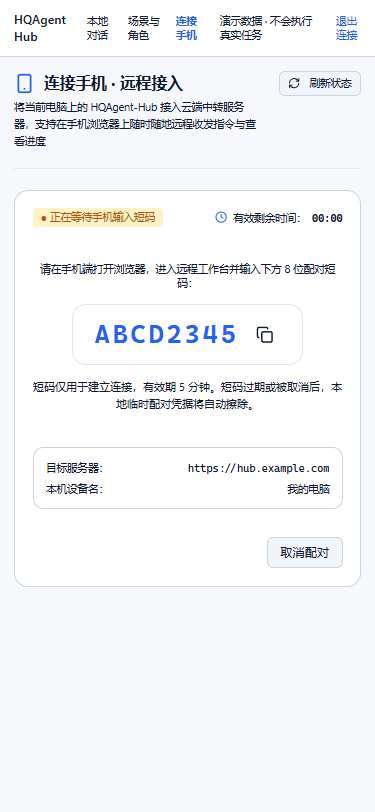
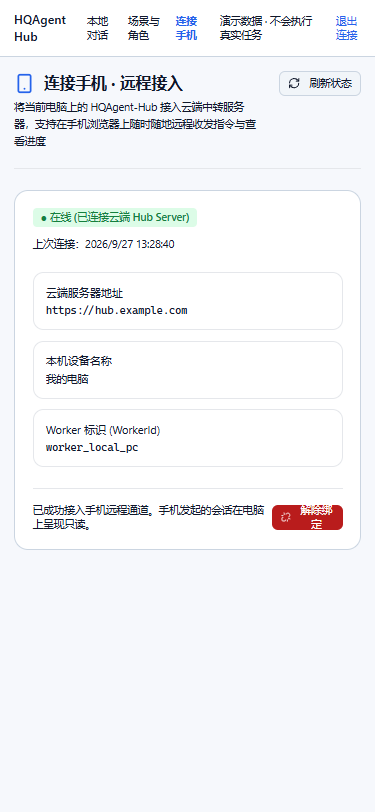

# 电脑端「连接手机」面板与远程对话只读交付 (R1-P3C)

- 分支：`feat/remote-pc-pairing`
- Worktree：`E:\OtherPro\HQAgent-Hub-worktrees\remote-pc-pairing`
- 基线：`integration/phase1`（41 files / 201 passed）
- 协议依赖：基于 `@hqagent/protocol` 0.6.0，使用本机会话 `/api/v2/remote/*` 契约，不调用亦不暴露需 Hub Token 的 `/api/v1/remote/*`
- 真实联调状态：**未对真实本机 Hub 自测**（本轮由前端在 MockLocalChatGateway 完备模拟 D44 接口、5 态机、错误码与 authority 阻断下开发和验证，待主代理合入真实 Hub D44 接口后进行端到端补测）

---

## 1. 变更文件清单

| 文件路径 | 改动说明 |
| --- | --- |
| `apps/desktop/src/shared/i18n/remote-link-errors.ts` | **新增**：远程配对与连接全量错误码映射字典（中文本地化文案，涵盖参数、网络、冲突、短码过期、离线、撤销、代次冻结、对话权限不匹配等） |
| `apps/desktop/src/shared/i18n/index.ts` | 导出错误字典及映射函数 `getRemoteLinkErrorMessage`，注册至本地化消息 |
| `apps/desktop/src/shared/api/local-chat-gateway.interface.ts` | 扩展 `LocalChatGateway` 接口，定义 D44 协议的 4 个方法：`getRemoteLink`、`startRemotePairing`、`cancelRemotePairing`、`unlinkRemote` |
| `apps/desktop/src/shared/api/local-chat-gateway.ts` | 实现真实的 `/api/v2/remote/*` 调用，携带 Cookie 凭据与 `Idempotency-Key`，对非 2xx 响应解析错误信封并抛出统一 `HubApiError` |
| `apps/desktop/src/shared/api/mock-local-chat-gateway.ts` | 实现完整的 5 状态机（`unpaired` / `pairing` / `paired` / `revoked` / `frozen`）、错误码模拟及测试辅助方法；注入默认远程对话 `conv_remote_mobile` 并对 `authority === 'remote'` 对话强校验抛出 409 `CONVERSATION_AUTHORITY_MISMATCH` |
| `apps/desktop/src/shared/api/local-chat-provider.ts` & `index.ts` | 增加 `setLocalChatGatewayForTesting` 测试桩注入支持 |
| `apps/desktop/src/stores/remote-link.store.ts` | **新增**：远程配对与状态管理 Store，纯内存维护响应式状态，零客户端持久化存储，支持短码 5 分钟倒计时、`pairing` 态 2s 轮询检测、主动取消配对与解绑 |
| `apps/desktop/src/stores/chat.store.ts` | 增加 `isRemoteConversation` 计算属性；归档能力判定中对 `authority === 'remote'` 返回 `false`；在 `sendMessage`、`controlRun`、`updateConversationMetadata` 中对远程对话强校验拦截并抛出 409 `CONVERSATION_AUTHORITY_MISMATCH` |
| `apps/desktop/src/pages/remote-link/RemoteLinkPage.vue` | **新增**：连接手机管理页面，响应式覆盖 5 种状态视图，提供超大 8 位短码与一键复制、倒计时、解绑二次确认弹窗（明确说明解绑后已有远程会话仍只读、服务端撤销说明）、冻结状态说明与无一键强行解冻保证 |
| `apps/desktop/src/pages/remote-link/RemoteLink.test.ts` | **新增**：覆盖 5 状态切换、轮询控制、短码倒计时、错误码中文映射、解绑弹窗二次确认要点说明、冻结状态无一键解冻按钮、零凭据持久化泄漏等 8 项单元测试 |
| `apps/desktop/src/pages/chat/RemoteConversationReadOnly.test.ts` | **新增**：覆盖桌面端远程对话只读提示横幅、输入框/发送/停止禁用、运行抽屉操作禁用、归档拦截、接口级 409 拒绝及本地对话不受影响等 7 项单元测试 |
| `apps/desktop/src/pages/chat/components/ChatSidebar.vue` | 任务列表对 `authority === 'remote'` 会话展示「远程」Badge；对话快捷菜单禁用归档；底部常驻「连接手机」快速入口 |
| `apps/desktop/src/pages/chat/components/ChatComposer.vue` | 远程对话时展示黄色只读提示横幅「这是手机远程对话，电脑端仅供只读查看，请在手机上继续操作。」，输入框与发送/停止按钮禁用，占位符更新为「这是手机远程对话，请在手机上继续」 |
| `apps/desktop/src/pages/chat/ChatPage.vue` | 顶部展示「手机远程」Badge；「重置 Agent 上下文」菜单项在远程对话中禁用；支持从路由参数直接定位对话 |
| `apps/desktop/src/pages/chat/components/RunSnapshotDrawer.vue` | 运行详情抽屉对远程对话展示黄色警告横幅「这是手机远程对话，运行控制请在手机上继续操作」，禁用暂停/重试/取消/审批等交互按钮 |
| `apps/desktop/src/app/router/index.ts` | 在 `LocalChatLayout` 下注册 `/remote-link` 路由 |
| `apps/desktop/src/app/layouts/LocalChatLayout.vue` | 顶部主导航增加「连接手机」直达链接 |
| `apps/desktop/src/app/layouts/components/AppSidebar.vue` | 全局侧边栏增加「连接手机」导航项 |
| `apps/desktop/.env.mock` | 本地 Mock 模式环境变量配置 |

---

## 2. 界面入口配置

1. **顶部主导航入口**：在 `LocalChatLayout.vue` 顶栏的导航栏中，新增「连接手机」链接（与「本地对话」「场景与角色」并列，路由为 `/remote-link`）。
2. **全局侧边栏入口**：在 `AppSidebar.vue` 菜单列表中增加「连接手机」项，图标为 `Smartphone`。
3. **聊天页面侧边栏底部入口**：在 `ChatSidebar.vue` 左侧项目任务树底部，增设固定快捷入口「连接手机 · 远程面板」，便于用户在会话中随时切换至配对管理页。

---

## 3. 轮询与倒计时策略

- **配对中状态（`pairing`）**：
  - 启动 2000ms（2s）定时轮询 `GET /api/v2/remote/link`，检测云端配对是否完成。
  - 启动 1000ms（1s）倒计时计时器，计算 `expiresAt` 剩余秒数；格式化展示为 `MM:SS`。
  - 当倒计时归零或接口返回已过期时，自动标记为过期并停止轮询。
  - 用户主动点击「取消配对」、切换页面卸载组件、或成功转入 `paired` 状态时，立即调用 `stopPairingPolling()` 彻底清除定时器，避免后台无效请求。
- **已配对与其它状态（`paired` / `unpaired` / `revoked` / `frozen`）**：
  - 不进行高频轮询；仅在页面挂载、用户手动点击「刷新状态」按钮、或从后台切回前台（`focus` / `visibilitychange`）时执行一次轻量状态拉取。

---

## 4. 只读判定与实现机制

1. **判定依据**：
   - 会话对象上的 `conversation.authority === 'remote'`（若未设置或为 `local` 则视为主控电脑本地对话）。
2. **界面层（UI）防御与引导**：
   - **聊天输入区 (`ChatComposer.vue`)**：
     - 条件渲染黄色提示横幅：`这是手机远程对话，电脑端仅供只读查看，请在手机上继续操作。`
     - `textarea` 增加 `:disabled="chatStore.isRemoteConversation"`，占位符切换为 `这是手机远程对话，请在手机上继续`。
     - 发送按钮与停止按钮均强制 `:disabled="true"`。
   - **任务侧边栏 (`ChatSidebar.vue`)**：
     - 会话标题右侧展示 `[远程]` Badge。
     - 会话右键/更多菜单中，归档操作被禁用（提示「手机远程对话（只读）」）。
   - **顶栏标题与上下文菜单 (`ChatPage.vue`)**：
     - 顶栏中心标题旁展示 `[手机远程]` 徽标。
     - 「重置 Agent 上下文」菜单项被强制禁用。
   - **运行详情抽屉 (`RunSnapshotDrawer.vue`)**：
     - 顶部展示黄色警告横幅：`这是手机远程对话，运行控制请在手机上继续操作`。
     - 阶段暂停、重试、取消任务、审批通过/拒绝等交互按钮均在只读模式下隐藏或禁用。
3. **Store 逻辑层拦截**：
   - `chatStore.sendMessage`：若目标会话为远程会话，拒绝提交并抛出 `HubApiError(..., 'CONVERSATION_AUTHORITY_MISMATCH', 409)`。
   - `chatStore.controlRun`：拒绝提交并抛出 409 `CONVERSATION_AUTHORITY_MISMATCH`。
   - `chatStore.renameConversation`：拒绝修改并抛出 409 `CONVERSATION_AUTHORITY_MISMATCH`。
   - `chatStore.canArchiveConversation`：对远程会话强制返回 `false`。
4. **Mock 网关层保障**：
   - `mockLocalChatGateway.sendLocalMessage`、`controlLocalRun`、`updateLocalConversation` 均对 `authority === 'remote'` 会话执行严格拦截，模拟返回 HTTP 409 与错误码 `CONVERSATION_AUTHORITY_MISMATCH`。
5. **本地会话零影响保证**：
   - 本地会话（`authority` 为 `undefined` 或 `local`）的所有输入、发送、控制、重命名、上下文重置和归档行为均完全不受影响，测试通过验证。

---

## 5. 解绑与冻结状态规范实现

1. **解绑二次确认弹窗 (`HqDialog`)**：
   - 触发解绑操作时弹出专用二次确认弹窗，明确提示两项核心须知：
     - **解绑后，已有的远程对话在电脑上仍是只读，不会变回本地对话；**
     - **服务端的设备凭据可能要在手机端再撤销一次该设备才能彻底失效。**
2. **冻结状态（`frozen`）严格限制**：
   - 展示警告徽标与说明：`本地存储世代与服务器代次不一致，已暂停指令投递`。
   - 提示：`存储世代需要核对，请联系管理员或通过本地诊断工具进行数据校准。系统不支持直接恢复投递。`
   - **严格不提供任何「一键解冻」或「强行解除冻结」的危险按钮**，仅保留「解除当前绑定」入口。

---

## 6. 安全红线合规核查

1. **凭据安全**：前端完全不调用 `/api/v1/remote/*`（避免需要 Hub Token）；所有远程管理通过本机 Worker 会话 `/api/v2/remote/*` 执行，依赖同源 HttpOnly Cookie。
2. **零客户端存储泄漏**：`remoteLinkStore` 状态为纯内存响应式变量，配对短码（Pair Code）、设备标识、Server Origin 等敏感信息绝不写入 `localStorage`、`sessionStorage` 或 `IndexedDB`。单元测试对此进行了自动化断言校验。

---

## 7. 暂未做到的点与后续联调建议

1. **真实 Hub 联调**：当前交付已在前端 Mock 环境下完备测试并通过全部 5 态机与异常流，但**未对真实本机 Hub 自测**。主代理完成 D44 接口合并后，需启动实际本机 Worker 进行真机扫描短码端到端联调。
2. **小程序与高级信令签名**：UI 保持极简纯净，未提前挂载未冻结的扩展按钮。

---

## 8. 交付截图

### 8.1 宽屏（1280×800）

#### 1. 未配对状态 (`remote-link-unpaired`)


#### 2. 配对中状态 (`remote-link-pairing`，8 位大短码与 5 分钟倒计时)


#### 3. 已配对连接状态 (`remote-link-paired`，在线状态与设备信息)


#### 4. 远程对话电脑只读查看 (`remote-chat-readonly`，只读横幅、输入禁用、抽屉控制锁定)


---

### 8.2 移动端（375×812）

#### 1. 未配对状态 (`remote-link-unpaired`)


#### 2. 配对中状态 (`remote-link-pairing`)


#### 3. 已配对连接状态 (`remote-link-paired`)


#### 4. 远程对话电脑只读查看 (`remote-chat-readonly`)


---

## 9. 真实命令验证输出

### 9.1 单元测试（43 files passed, 216 tests passed，基线 201 tests 保持 100% 通过）

```text
$ pnpm --filter @hqagent/desktop test

 RUN  v2.1.9 E:/OtherPro/HQAgent-Hub-worktrees/remote-pc-pairing/apps/desktop

 ✓ src/shared/api/local-hub-gateway.test.ts (8 tests)
 ✓ src/shared/api/local-chat-gateway.test.ts (8 tests)
 ✓ src/shared/api/mock-local-chat-gateway.test.ts (16 tests)
 ✓ src/pages/chat/components/ProcessActivityGroup.test.ts (5 tests)
 ✓ src/stores/chat.polling.test.ts (6 tests)
 ✓ src/stores/scenes.store.test.ts (6 tests)
 ✓ src/stores/chat.context.test.ts (7 tests)
 ✓ src/stores/chat.reliability.test.ts (7 tests)
 ✓ src/stores/chat.store.test.ts (9 tests)
 ✓ src/stores/task.store.test.ts (7 tests)
 ✓ src/shared/api/mock-gateway.test.ts (10 tests)
 ✓ src/stores/app.store.test.ts (8 tests)
 ✓ src/shared/theme/theme.engine.test.ts (5 tests)
 ✓ src/shared/ui/HqMarkdown.test.ts (6 tests)
 ✓ src/stores/approval.store.test.ts (4 tests)
 ✓ src/pages/chat/components/RunSnapshotDrawer.test.ts (1 test)
 ✓ src/pages/chat/components/ChatSidebar.test.ts (3 tests)
 ✓ src/pages/chat/components/ChatMessageItem.test.ts (3 tests)
 ✓ src/pages/chat/components/ChatComposer.test.ts (7 tests)
 ✓ src/pages/tasks/TaskDetailPage.test.ts (5 tests)
 ✓ src/pages/chat/RemoteConversationReadOnly.test.ts (7 tests)
 ✓ src/pages/remote-link/RemoteLink.test.ts (8 tests)
 ✓ src/pages/scenes/ScenesPage.test.ts (9 tests)
 ✓ src/pages/chat/ChatPage.test.ts (7 tests)
 ✓ src/app/layouts/AppLayout.test.ts (3 tests)
 ✓ src/pages/approvals/ApprovalsPage.test.ts (3 tests)
 ✓ src/shared/api/local-chat-timeout.test.ts (3 tests)
 ✓ src/stores/chat.action-scope.test.ts (2 tests)
 ✓ src/stores/team.store.test.ts (5 tests)
 ✓ src/stores/workspace.store.test.ts (3 tests)
 ✓ src/pages/tasks/TasksPage.test.ts (3 tests)
 ✓ src/stores/agent.store.test.ts (3 tests)
 ✓ src/pages/templates/TemplatesPage.test.ts (3 tests)
 ✓ src/pages/sessions/SessionsPage.test.ts (3 tests)
 ✓ src/pages/agents/AgentsPage.test.ts (3 tests)
 ✓ src/pages/auth/ConnectPage.test.ts (2 tests)
 ✓ src/pages/onboarding/OnboardingPage.test.ts (2 tests)
 ✓ src/stores/local-auth.store.test.ts (2 tests)
 ✓ src/pages/workspaces/WorkspacesPage.test.ts (3 tests)
 ✓ src/pages/teams/TeamsPage.test.ts (3 tests)
 ✓ src/shared/ui/HqButton.test.ts (4 tests)
 ✓ src/pages/overview/OverviewPage.test.ts (2 tests)
 ✓ src/stores/session.store.test.ts (2 tests)

 Test Files  43 passed (43)
      Tests  216 passed (216)
   Duration  8.85s
```

### 9.2 类型检查（Typecheck 0 错误）

```text
$ pnpm --filter @hqagent/desktop typecheck
$ vue-tsc --noEmit
# 检查通过，退出码 0
```

### 9.3 代码风格检查（Lint 0 错误 0 警告）

```text
$ pnpm --filter @hqagent/desktop lint
$ eslint src
# 检查通过，退出码 0
```

### 9.4 生产构建（Build 成功）

```text
$ pnpm --filter @hqagent/desktop build
$ vue-tsc --noEmit && vite build
vite v5.4.21 building for production...
transforming...
✓ 1721 modules transformed.
rendering chunks...
computing gzip size...
dist/index.html                                                   2.50 kB │ gzip:  1.02 kB
dist/assets/RemoteLinkPage-BEmmpRpC.js                           17.71 kB │ gzip:  6.64 kB
dist/assets/ChatPage-IXUJw3Ks.js                                 69.86 kB │ gzip: 21.16 kB
dist/assets/index-ouCbvsmW.js                                   198.80 kB │ gzip: 63.92 kB
✓ built in 13.80s
```
