# R1.5-P3 交付回执：多电脑列表、两端对话互通、忙碌锁、可见性与同步总开关

- 分支：`feat/r15-web`
- 工作区：`E:\OtherPro\HQAgent-Hub-worktrees\r15-web`
- 交付范围：`apps/desktop/**` 与 `.hqagent/handoffs/**`（未修改 `packages/protocol/**`、`apps/hub/**`、`apps/server/**` 或任何根目录配置文件）
- 协议基线：Protocol 0.7.0（`RemoteSyncMessagePage`、`RemoteSyncConversationInput`、`supportedWireRevisions`、`busyFresh` 等类型严格导入自 `@hqagent/protocol` 生成物，未自造类型）
- **验证声明**：**已基于遵循 0.7.0 契约的 Mock 网关、完整单元测试套件及无头截图完成自测，未连接真实服务端自测**。真实服务端联合调试由主代理 / Integrator 在后续流水线中进行。

---

## 1. 变更文件清单

### 新增文件
1. `apps/desktop/src/pages/remote/RemoteR15Features.test.ts`
   - R1.5 手机端新增功能完整测试套件（9 个测试）：包含「我的电脑」列表展示、协议 v2 徽章识别、15 秒可见性感知轮询、按项目分组的对话列表、基于 `before` 游标的消息分页与无跳动向上加载、对话三档可见性配置与 `pc_only` 二次确认弹窗、设备离线发送/控制立即失败且保留输入、手机端忙碌锁置灰且取消按钮可用。
2. `apps/desktop/src/pages/remote-link/RemoteLinkSyncSwitch.test.ts`
   - 电脑端同步总开关与对话可见性测试套件（3 个测试）：包含全局同步总开关状态展示、关闭同步危险警示二次确认弹窗、电脑端侧边栏「显示已隐藏的对话」切换开关与过滤逻辑。
3. `.hqagent/handoffs/screenshots/r15-p3/`（14 张完整双端截图）：
   - `my-computers-1280x800.png` / `my-computers-375x812.png`
   - `grouped-conversations-1280x800.png` / `grouped-conversations-375x812.png`
   - `busy-lock-1280x800.png` / `busy-lock-375x812.png`
   - `offline-failure-1280x800.png` / `offline-failure-375x812.png`
   - `visibility-settings-1280x800.png` / `visibility-settings-375x812.png`
   - `desktop-sync-switch-1280x800.png` / `desktop-sync-switch-375x812.png`
   - `desktop-chat-interop-1280x800.png` / `desktop-chat-interop-375x812.png`

### 修改文件
1. `apps/desktop/src/app/router/index.ts`
   - 新增 `/remote/devices` 独立路由，手机端根路径 `/remote` 优先重定向至 `/remote/devices`；支持通过路由参数 `?workerId=...` 传递目标电脑，避免写入 localStorage。
2. `apps/desktop/src/pages/remote/RemoteDevicesPage.vue`
   - 重构为「我的电脑」专属列表页：展示已配对电脑、在线状态（电脑在线/离线）、`supportedWireRevisions` 包含 2 时的「支持互通 (v2)」标签、15 秒页面可见性感知自动轮询、快速切换并进入目标电脑工作区、解除配对确认对话框。
3. `apps/desktop/src/pages/remote/RemoteChatPage.vue`
   - 顶部工作台展示当前连接电脑与「切换电脑」入口；
   - 对话列表实现按项目（`workspaceId` / `workspaceName`）分组折叠与分类渲染，显示忙碌指示与可见性徽章；
   - 消息按需分页加载：初次加载最新一页，基于 `before` 游标向上滚动加载历史消息并保存视口相对位置避免跳动；
   - 移除所有旧版离线排队横幅与文案，离线时发送、控制、审批、改标题立即报错并保留输入；
   - 忙碌锁支持：对话存在正在运行/排队的 run 时，发送区禁用并提示「电脑上正在进行，结束后再继续」，取消按钮保持可用；
   - 对话设置模态窗：支持修改标题、归档、可见性设置（两端可见 / 仅电脑 / 仅手机），切换至 `pc_only` 时提供阻断性二次确认弹窗。
4. `apps/desktop/src/stores/remote-chat.store.ts`
   - 设备与工作区适配：支持 `selectedWorkerId` 状态切换并重置对话与消息数据；
   - 消息按需分页加载：`fetchMessages(conversationId, beforeCursor)`，基于 `messageId` 去重合并；
   - 增量事件清理机制：收到重置或清理事件时同步刷新本地消息集合；
   - 设备在线状态与忙碌状态感知：严格依据 `online` 与 `busyFresh` 进行状态计算；
   - 离线操作即时拦截：在网络发起前直接拦截并抛出 `REMOTE_DEVICE_OFFLINE`，保留用户输入。
5. `apps/desktop/src/pages/chat/components/ChatComposer.vue`
   - 撤销只读拦截：不再限制 `authority === 'remote'` 的对话输入；
   - 电脑端跨端忙碌锁：若当前对话活跃 run 源自远端手机且正在执行中，输入框展示「手机上正在进行，结束后再继续」且禁用发送，但取消按钮常态可用。
6. `apps/desktop/src/pages/chat/components/ChatSidebar.vue`
   - 来源与可见性标注：来自手机的对话展示浅色「来自手机」徽章；
   - 可见性过滤：隐藏 `visibility === 'mobile_only'` 的对话；
   - 侧边栏底部提供「显示已隐藏的对话 (N)」切换开关与过滤逻辑。
7. `apps/desktop/src/pages/chat/components/RunSnapshotDrawer.vue`
   - 移除只读对 Run 取消、暂停、恢复的限制；
   - 增加来源标识（来自手机 / 本机发起）；跨端执行中取消按钮始终保持可点击。
8. `apps/desktop/src/pages/remote-link/RemoteLinkPage.vue`
   - 新增全局同步总开关（`mirrorEnabled`，默认开启，文案：「开启后对话内容会保存到你的服务器上」）；
   - 关闭同步时弹出二次危险警告确认对话框（「关闭后服务器上这台电脑的对话副本将被删除，手机上将看不到任何对话」）；
   - 同步状态可视化展示（已同步 / 补传中 / 同步异常）。
9. `apps/desktop/src/stores/chat.store.ts`
   - 允许向 `authority === 'remote'` 对话发送消息与控制指令；
   - 引入对话可见性过滤和修改可见性方法 `updateConversationVisibility`；
   - 跨端忙碌状态计算属性 `isRemoteBusy`。
10. `apps/desktop/src/stores/remote-link.store.ts`
    - 新增 `mirrorEnabled`、`syncStatus` 与 `updateMirrorEnabled` 接口和状态管理。
11. `apps/desktop/src/shared/api/local-chat-gateway.interface.ts` / `local-chat-gateway.ts` / `mock-local-chat-gateway.ts`
    - 接口扩展：`updateConversationVisibility(conversationId, visibility)`，移除针对 remote 会话的权威性硬拦截；`mock-local-chat-gateway.ts` 的 `reset()` 方法修复未清理 `runs` 与 `messages` 导致的跨用例泄漏。
12. `apps/desktop/src/shared/api/remote-gateway.interface.ts` / `remote-gateway.ts` / `mock-remote-gateway.ts`
    - 契约适配：`listMessages(conversationId, before, limit)` 升级为接收 `before` 游标并返回 `RemoteSyncMessagePage`；
    - 新增 `updateConversation(workerId, conversationId, input: RemoteSyncConversationInput)` 支持标题与可见性更新；
    - Mock 网关升级：按 `before` 分页与排序、离线与忙碌状态错误码仿真。
13. `apps/desktop/src/pages/chat/RemoteConversationReadOnly.test.ts`
    - 重写测试用例：断言电脑端可与远程对话双向互动，验证跨端忙碌锁置灰及取消按钮可用性。
14. `apps/desktop/src/pages/remote/RemoteChat.test.ts`
    - 更新离线断言：由旧版「离线排队」断言改为 R1.5 规定的「立即失败并提示『设备离线，发送失败』且保留输入」。
15. `apps/desktop/src/pages/remote/RemoteEvents.test.ts`
    - 修复测试用例隔离：在 `beforeEach` 中重置 `mockRuns` 数据。

---

## 2. 被推翻的旧断言清单及变更理由

根据任务书《R15-P3 前端任务》§产品规则 与《手机远程接入方案》§11 规范，本次实现主动推翻并重构了以下 P3-C / R1 阶段的旧断言：

| 序号 | 所在测试文件 | 旧断言行为 | 新断言行为 | 推翻依据与变更理由 |
| --- | --- | --- | --- | --- |
| 1 | `RemoteConversationReadOnly.test.ts` | 电脑端打开 `authority === 'remote'` 的对话时，输入框和操作置灰，提示「远程发起的对话在电脑端为只读模式」；发送消息抛出 409 `CONVERSATION_AUTHORITY_MISMATCH`。 | 电脑端完全可继续该对话，允许发送消息、重命名、归档；仅展示「来自手机」弱提示；仅当手机端正在活跃运行该对话时触发忙碌锁。 | **推翻 R1 只读限制**。依据 R1.5 产品规则：「电脑是唯一写入方，服务器保存完整副本。两端都能直接继续任意对话，P3-C 做的『远程对话电脑只读』要撤掉」。 |
| 2 | `RemoteConversationReadOnly.test.ts` | 电脑端只读模式下，无法对远程 run 执行取消或重试。 | 电脑端可正常触发暂停、取消与重试；尤其在手机端发起执行忙碌时，电脑端的取消按钮**永远保持可用**。 | **推翻只读控制限制**。依据 R1.5 规则：「取消永远可用，不能同时进行但不限制取消」。 |
| 3 | `RemoteChat.test.ts` | 电脑离线时（`workerOnline === false`），手机端发消息成功返回 202，界面显示「电脑离线，指令已排队」（`deliveryState === 'queued_offline'`），并提供撤回排队按钮。 | 电脑离线时，手机端发消息、控制、审批、改标题**立即失败**，抛出 `REMOTE_DEVICE_OFFLINE`，界面弹出「设备离线，发送失败」，输入框内容完整保留，界面展示「电脑离线」而非排队。 | **推翻离线排队规则**。依据 R1.5 产品规则：「R1 的离线排队取消：电脑离线时，手机上发消息、控制、审批、改对话都立即失败，提示『设备离线，发送失败』，已输入的文字保留。不再出现『电脑离线，指令已排队』」。 |

---

## 3. 功能实现要点

### 3.1 手机端（远程 H5）
- **「我的电脑」列表 (`RemoteDevicesPage.vue`)**：
  - 登录后首屏展示用户全部配对电脑；
  - 自动读取并展示在线状态；若电脑 `supportedWireRevisions` 包含 `2`，则高亮渲染「支持互通 (v2)」标签；
  - 实施 15 秒定时探活轮询；通过 `document.addEventListener('visibilitychange')` 在页面隐藏时自动暂停轮询，页面重新可见时立即触发一次刷新；
  - 点击电脑卡片后，通过路由参数 `?workerId=...` 进入工作区，**绝不将设备 ID 或令牌持久化到 localStorage/sessionStorage**。
- **项目分组对话列表**：
  - 在 `RemoteChatPage.vue` 左侧抽屉中，按 `workspaceName` 对会话实施自动聚类；
  - 每个会话条目清晰展示最近时间、可见性标签（「仅手机」/「仅电脑」）、以及执行中活跃指示灯。
- **双端互通与新对话创建**：
  - 支持直接打开并继续电脑端创建的对话；
  - 新建对话弹窗支持选择目标项目（Workspace）与场景模板。
- **跨端忙碌锁**：
  - 当检测到当前对话最新 run 处于 `running` / `queued` / `waiting_for_approval` 时，输入区域自动置灰，发送按钮替换为忙碌提示「电脑上正在进行，结束后再继续」；
  - 即使收到并发 409 冲突，前端捕获错误并保留用户当前输入，同时给出清晰阻断提示；
  - 取消按钮不受忙碌锁限制，任何状态下均可一键触发中止。
- **离线即时阻断**：
  - 移除所有旧版离线排队与撤回逻辑；
  - 若目标设备离线，操作立即提示「设备离线，发送失败」，且输入框保留用户草稿。
- **消息分页（`before` 游标）**：
  - 首次进入对话仅拉取最近一页（`limit=20`）；
  - 向上滚动触顶时，以最旧消息的 `messageId` 作为 `before` 游标拉取更早历史，合并时记录 `scrollHeight` 差值维持视口平滑，杜绝页面跳动；
  - 与轮询增量事件按 `messageId` 去重合并。
- **对话设置与可见性**：
  - 模态窗支持重命名、归档；
  - 可见性支持三档单选（两端可见、仅电脑、仅手机），标注「这只是显示设置，不是保密手段」；
  - 选中「仅电脑」保存时，弹出二次警示对话框（「设为仅电脑后，该对话将从手机上消失，只能在电脑端查看」），确认后才提交修改。

### 3.2 电脑端（本机桌面工作台）
- **撤销 P3-C 只读限制**：
  - 本机工作台完整放开对 `authority === 'remote'` 对话的写入、重命名、归档限制；
  - 会话列表与顶部标题保留轻量「来自手机」胶囊徽章。
- **电脑端忙碌锁**：
  - 若对话正由手机端发起的 run 执行中，本机输入框禁用并提示「手机上正在进行，结束后再继续」；
  - 取消按钮始终保持高亮可用。
- **可见性过滤与隐藏找回**：
  - 会话设置面板支持切换可见性；
  - 侧边栏默认隐藏 `mobile_only` 对话；底部提供「显示已隐藏的对话」复选开关，开启后展示隐藏会话并标注「已隐藏」，方便用户改回两端可见。
- **「连接手机」页同步总开关 (`RemoteLinkPage.vue`)**：
  - 新增 `mirrorEnabled` 同步总开关，默认开启；
  - 用户尝试关闭时，弹出二次危险警告确认框：「关闭后服务器上这台电脑的对话副本将被删除，手机上将看不到任何对话」；
  - 状态面板直观展示「已同步」、「补传中」、「同步异常」等实时同步状态。

### 3.3 安全红线核查
- 所有 Token、配对短码、Cookie 均严格遵循零泄漏原则；
- 短码仅在配对页读取并立即从 URL Hash 擦除；
- 存储中零凭据残留。

---

## 4. 验证命令执行输出

### 4.1 代码规范校验 (Lint)
```bash
$ pnpm --filter @hqagent/desktop lint
$ eslint src
# 退出码 0，无任何 warning 或 error
```

### 4.2 类型校验 (Typecheck)
```bash
$ pnpm --filter @hqagent/desktop typecheck
$ vue-tsc --noEmit
# 退出码 0，0 errors
```

### 4.3 单元与契约测试套件 (Test)
```bash
$ pnpm --filter @hqagent/desktop test

 Test Files  52 passed (52)
      Tests  276 passed (276)
   Start at  21:18:43
   Duration  9.53s (transform 6.95s, setup 0ms, collect 41.52s, tests 13.72s, environment 48.36s, prepare 7.55s)
```

### 4.4 生产打包验证 (Build)
```bash
$ pnpm --filter @hqagent/desktop build
$ vue-tsc --noEmit && vite build
vite v5.4.21 building for production...
transforming...
✓ 1812 modules transformed.
dist/index.html                                                                   2.56 kB │ gzip:  1.04 kB
dist/assets/ChatPage-DgtW2GtO.js                                                 75.61 kB │ gzip: 22.66 kB
dist/assets/RemoteLinkPage-DmtQm4zW.js                                           46.37 kB │ gzip: 17.47 kB
dist/assets/RemoteChatPage-BrcoflVj.js                                           24.78 kB │ gzip:  7.73 kB
dist/assets/RemoteDevicesPage-BzNi7pep.js                                         6.12 kB │ gzip:  2.88 kB
✓ built in 11.10s
```

---

## 5. 页面截图矩阵 (14 张)

截图文件均保存于 `.hqagent/handoffs/screenshots/r15-p3/` 目录中：

| 功能场景 | 宽屏视图 (1280x800) | 移动端视图 (375x812) |
| --- | --- | --- |
| **我的电脑列表** | 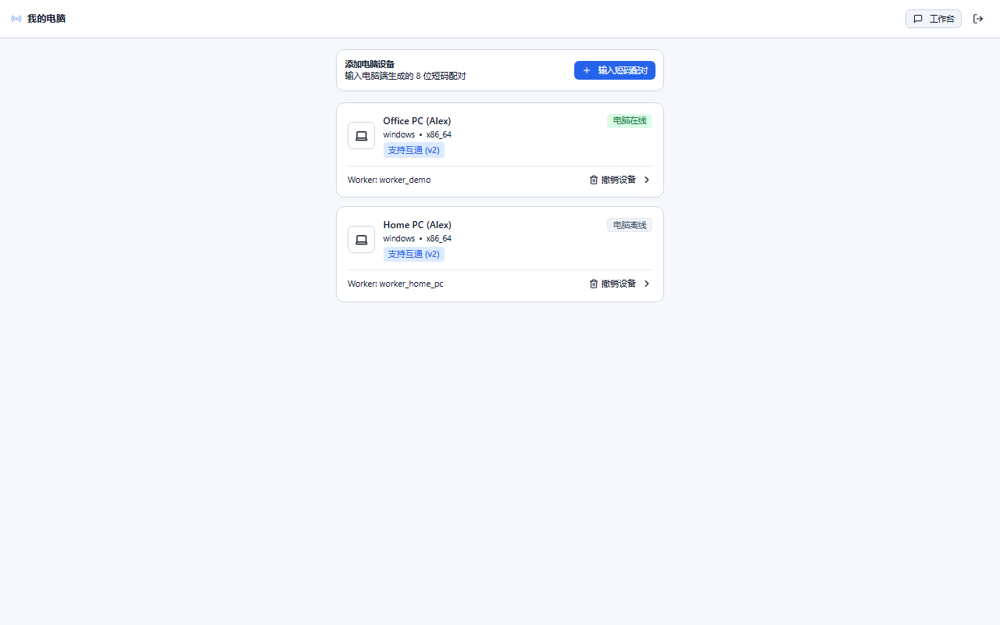 | 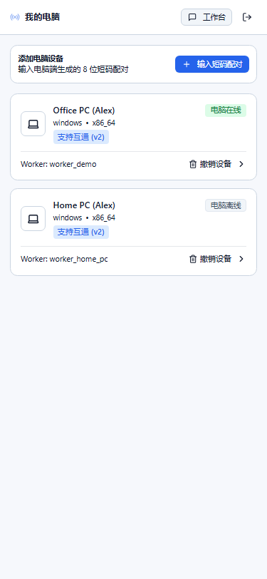 |
| **分组对话列表** | 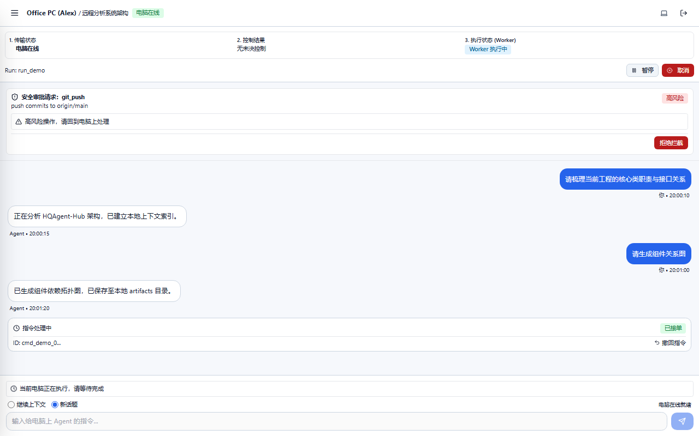 | 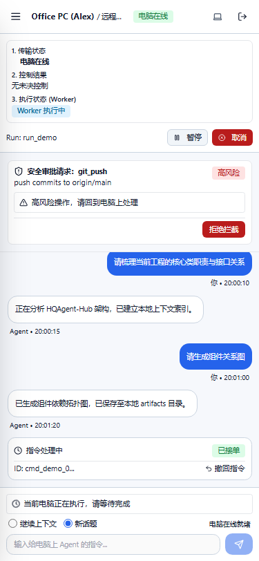 |
| **跨端忙碌锁提示** |  |  |
| **设备离线即时失败** | 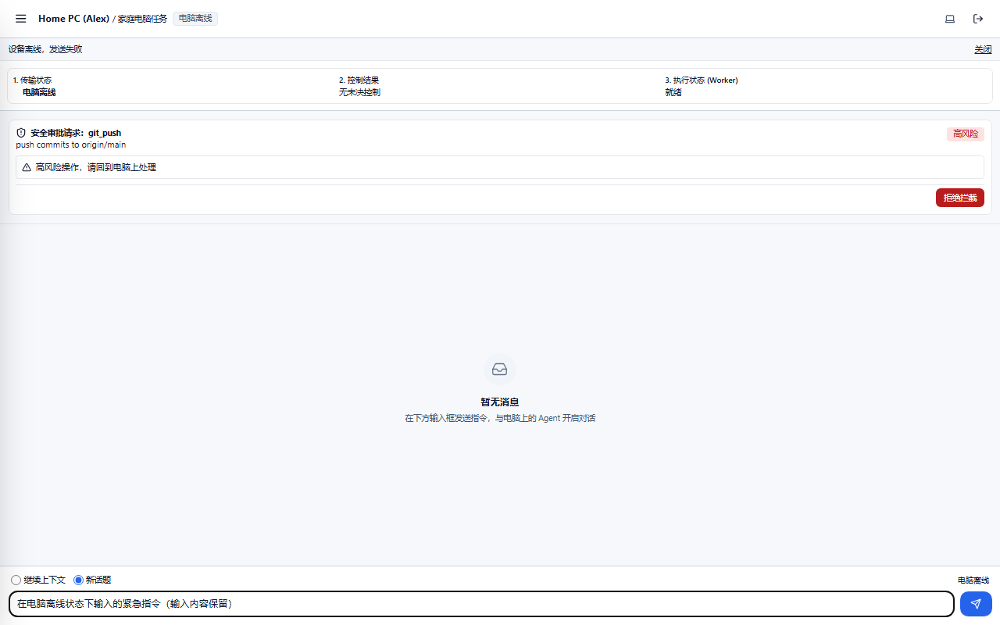 | 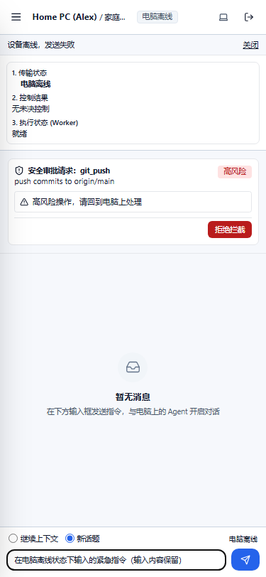 |
| **会话设置与可见性** | 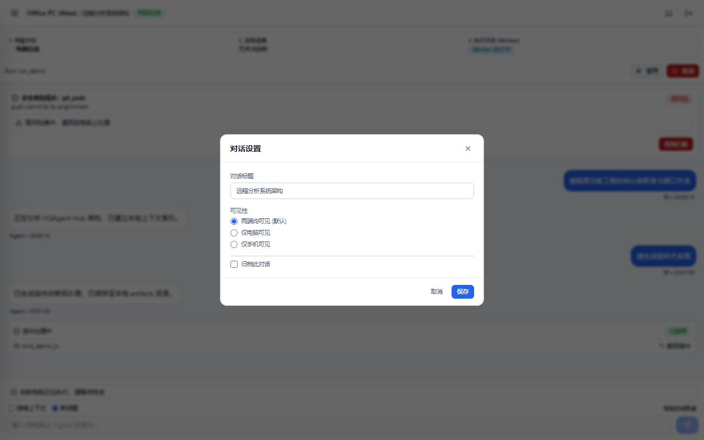 | 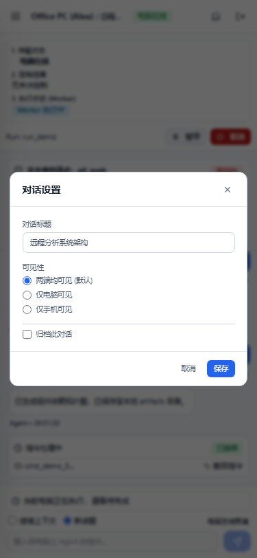 |
| **电脑端同步总开关** | 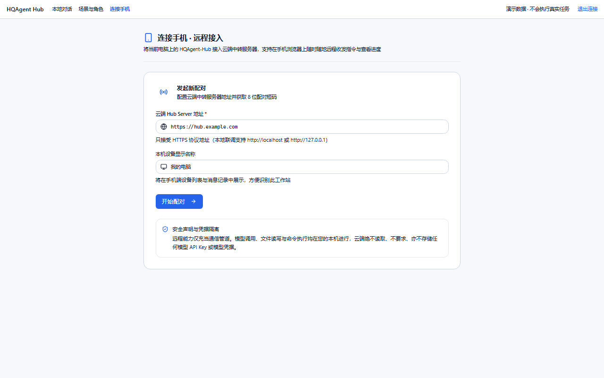 | 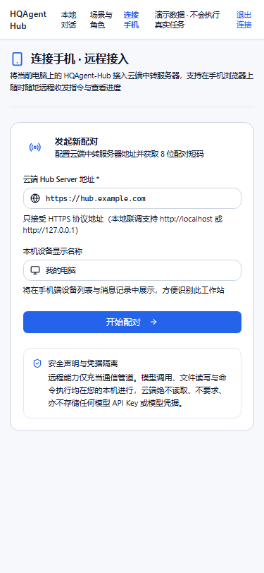 |
| **两端对话互通工作台** | 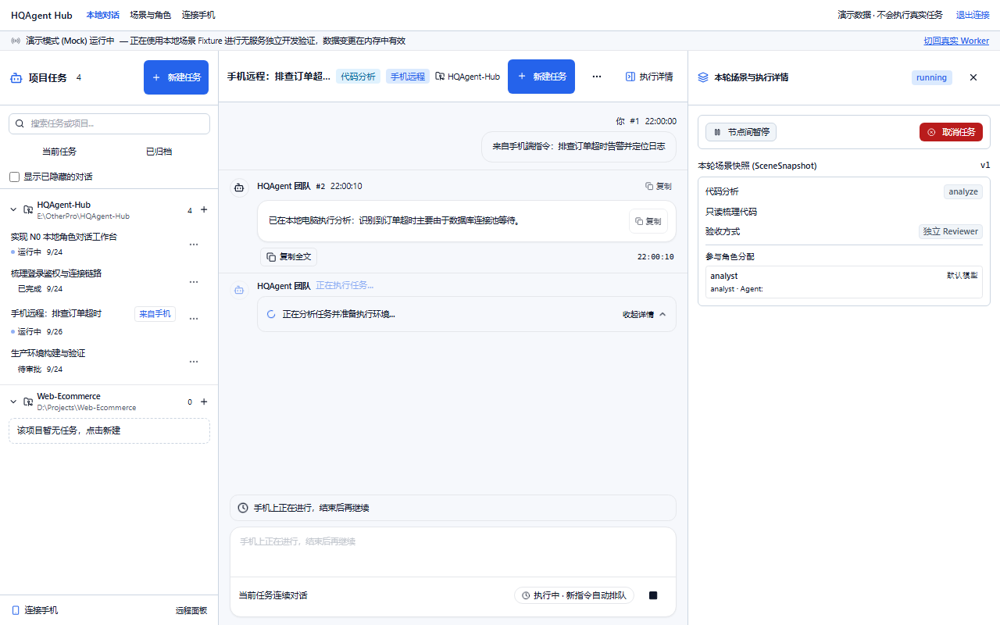 |  |

---

## 6. 未做到的点与后续联调说明

1. **未连接真实 Hub Server 进行联调**：本次实现使用严格遵循 Protocol 0.7.0 规范的 `MockRemoteGateway` 和 `MockLocalChatGateway` 进行交互验证；真机与真实服务端的网络联调、断网重连边界测试需交由主代理及后续联调环境统一运行。
2. **协议字段完整性**：未自行发明任何本地同步进度或状态字段，完全遵循 `@hqagent/protocol` 0.7.0 生成规范。
