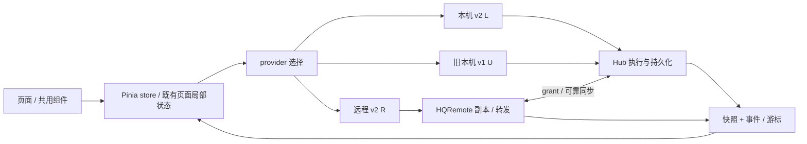

# HQAgent-Hub 前后端交接手册

## 变更记录

| 日期 | 版本 | 变更说明 |
| --- | --- | --- |
| 2026-10-04 | v1.0 | 按集成基线 `982f130` 核对实际页面、gateway、store 与协议，归并前端开工、UI审计和前后端对接说明；精选审计基线 `9b0bb75` 的 mock 截图。未运行测试、真实模型或线上接口。 |

本手册面向接手 UI/交互优化的前端开发者及后端联调方。项目已功能冻结，任务是改善已有功能；总体架构、构建发布与工作包所有权见[项目文档](项目文档.md)。**审计建议不等于改动授权：只改展示/交互层，不改 stores、gateway 或协议 DTO 语义；需要改变状态逻辑先提 handoff。**

## 1. 快速上手

### 1.1 技术栈与目录

Vue3.5 + TypeScript5.5 + Vite5 + Pinia2 + vue-router4，Tailwind3/CSS变量、lucide-vue-next 图标，Vitest2 + Vue Test Utils/jsdom，ESLint；桌面宿主 Tauri2/Rust。模型、运行状态和 API DTO 从 `@hqagent/protocol` 导入，不在 UI 另定义。

以下路径均相对 `apps/desktop/src/`：

```text
App.vue / main.ts                  应用入口
app/router/index.ts                唯一路由表与本机/远程守卫
app/DesktopConnection.vue          壳启动、恢复与维护遮罩
app/layouts/                       AppLayout / LocalChatLayout
  components/                      Header、Sidebar、状态栏、日志、Inspector
pages/chat/                        本地对话；components/ 中含输入、消息、侧栏、运行与删除
pages/remote/                      登录、设备、配对、对话、API令牌、扫码
pages/native/                      原生会话、同步说明、授权根、手机登记项目
pages/remote-link/                 电脑“连接手机”
pages/agents/ / scenes/            Agent/图片验证、场景角色
pages/workspaces/ / teams/         旧工作区、团队配置
pages/tasks/ / sessions/ / approvals/ / overview/ / templates/
pages/auth/ / onboarding/         本机连接、引导
pages/common/PlaceholderPage.vue   设置/软件更新共用占位
pages/dev/UiKitPage.vue            仅DEV组件样例
stores/                            Pinia业务状态（本轮UI不可改语义）
shared/api/                        UiGateway、本机v2、远程gateway及mock
shared/ui/                         共用控件/覆盖层
shared/attachments/                附件草稿、上传、哈希、消息附件、预检
shared/runtime/                    Runtime图标、PI guard/模型呈现
shared/maintenance/                图片验证与删除冲突安全呈现
shared/theme/ / i18n/ / qr/        主题、中文错误、二维码
shared/testing/                    冻结原型浏览器回归
mocks/scenarios/                   引用协议fixture的UI场景
```

### 1.2 三种启动方式

从仓库根安装固定前端依赖并启动 mock：

```powershell
pnpm install --frozen-lockfile
pnpm dev:mock
# Vite默认5173；终端显示实际地址
```

Mock 是前端内存模拟。旧 v1 页面用 `MockGateway`，本地聊天用 `MockLocalChatGateway`，远程页用 `MockRemoteGateway`；一个 mock 开关不等于三个 provider 的判断完全相同。本地聊天模式优先读取 `localStorage.hqagent_local_chat_mode`；曾切到 real 时，使用页面现有模式切换回 mock，或在该开发站点控制台执行 `localStorage.removeItem('hqagent_local_chat_mode')` 后刷新。这里存的是模式偏好，不能存 token。

连接真实本机 Hub：先按[项目文档 §5](项目文档.md#5-开发构建验证与交付)创建 `.venv`、启动8765 Hub，再运行：

```powershell
$env:VITE_GATEWAY_MODE = 'local'
# 不设时默认代理到127.0.0.1:8765
$env:VITE_WORKER_BASE_URL = 'http://127.0.0.1:8765'
pnpm dev
```

打开 `/connect` 用 Hub 控制台的一次性连接码换 Cookie。本地 v2 工作台无需 Hub Token。**旧 v1 管理页面的 UiGateway 是另一条接线**：real 模式需要 Tauri endpoint；代码保留 DEV `VITE_HUB_BASE_URL/VITE_HUB_TOKEN` 分支，但不能把真实 token 写进 `.env`、构建产物或仓库。本手册不把它作为普通浏览器接入方法，旧页实机联调用壳。

桌面壳：先准备 Hub onedir 与 Rust/MSVC/WebView2，`pnpm --dir apps/desktop exec tauri dev`；壳强制 real、本地路由，通过 IPC 取 endpoint。Tauri 下访问 `/connect`、`/remote/*` 会回 `/chat`，“连接手机”实际是 `/remote-link`。NSIS 构建使用 `apps/desktop/scripts/build-windows.ps1`，默认4个 Cargo jobs，详见项目文档。

远程 H5：同一 Vue build 部署到 HQRemote 同源域名，`/remote/*` 自动选远程模式；也可构建时 `VITE_GATEWAY_MODE=remote` 让根入口转设备列表。开发 Vite 的 `/api` 默认代理本地 Hub，不要拿它当云端服务；真实 Cookie/CSRF/Secure Cookie 联调使用正确 HTTPS 同源环境。

### 1.3 验证命令

以下供后续 UI 开发执行，本次纯文档整理未运行：

```powershell
pnpm --dir apps/desktop lint
pnpm --dir apps/desktop typecheck
pnpm --dir apps/desktop exec vitest run --minWorkers=1 --maxWorkers=2
pnpm --dir apps/desktop build
# 范围较小时只指定受影响文件，例如：
pnpm --dir apps/desktop exec vitest run src/stores/chat.polling.test.ts src/shared/ui/SharedOverlays.test.ts --minWorkers=1 --maxWorkers=2
```

只跑与改动相关的用例；保留既有断言。代码不改无需跑业务测试。真实相机、触控/键盘、Tauri 与模型路径需独立场景验收，不能用 mock 代替。

## 2. 页面地图

路由依据 [router/index.ts](../apps/desktop/src/app/router/index.ts)。下表组件路径均以 `apps/desktop/src/` 为根；store 简名如 `chat` 即 `stores/chat.store.ts`。

Gateway 简记：**L** = `shared/api/local-chat-gateway.ts`（本机v2，维护操作壳改走v1）；**U** = `shared/api/local-hub-gateway.ts`（旧v1管理页）；**R** = `shared/api/remote-gateway.ts`（云端v2）。方法未标注的读取为 GET；`{id}` 是真实资源标识，不从显示名构造。所有截图均为合成 mock，完整选图记录见 [selection.json](assets/ui/selection.json)。

### 2.1 远程 H5 页面与内嵌状态

| 页面/路由 | 用途与组件文件 | store / gateway | 实际接口路径 | 手机/电脑差异与截图 |
| --- | --- | --- | --- | --- |
| `/remote/login` | 云端账号登录；`pages/remote/RemoteLoginPage.vue` | remote-auth / R | POST `/api/v2/auth/login`；GET `/auth/session`、POST `/auth/logout` 均带 `/api/v2` 前缀 | 手机主入口；普通电脑浏览器也能打开，壳不进入。 [亮](assets/ui/mobile-375-light/M01-login.png) / [暗](assets/ui/mobile-375-dark/M01-login.png) |
| `/remote/devices` | 电脑列表、详情菜单、别名、暂停/恢复、删除；`RemoteDevicesPage.vue` | remote-chat、remote-auth / R | `/api/v2/devices`；GET/PATCH/DELETE `/api/v2/devices/{workerId}`；`/api/v2/devices/{workerId}/catalog` | **没有独立设备详情路由**，详情/管理在菜单；在线状态与暂停状态独立。[列表](assets/ui/mobile-375-light/M04-devices.png)、[详情](assets/ui/mobile-375-light/M05-device-menu.png)、[删除](assets/ui/mobile-375-light/M06-device-delete-confirm.png) |
| `/remote/pair` | 输入码→预览→确认；`RemotePairingPage.vue`、`PairingScanner.vue`、`pairing-qr.ts`、`pairing-decoder.ts` | remote-auth + 页面局部状态 / R | POST `/api/v2/pairings/preview`；POST `/api/v2/pairings/{pairRequestId}/confirm` | 手机可相机扫码，电脑可手填；识别不自动确认。[输入](assets/ui/mobile-375-light/M11-pairing.png)、[预览](assets/ui/mobile-375-light/M12-pairing-preview.png)、[扫码](assets/ui/mobile-375-light/M14-scanner-preview.png)、[权限失败](assets/ui/mobile-375-light/M15-scanner-permission.png) |
| `/remote/chat?workerId=…` 列表/新建/设置 | 项目分组、选对话、创建、可见性；`RemoteChatPage.vue` | remote-chat / R | GET/POST `/api/v2/conversations`；GET/PATCH `/api/v2/conversations/{id}`；`/api/v2/commands/{commandId}`；`/api/v2/devices/{workerId}/catalog` | 手机侧栏遮罩，宽屏并排；创建202先等真实资源，不能造假ID。没有独立对话列表路由，也没有任意新建“分组”功能。[列表](assets/ui/mobile-375-light/M19-conversation-list.png)、[新建](assets/ui/mobile-375-light/M20-new-conversation.png)、[设置](assets/ui/mobile-375-light/M44-conversation-settings.png) |
| 同路由：空态/正常/运行/排队回执/失败 | `RemoteChatPage.vue`、`RemoteRequestNotice.vue` | remote-chat / R | `/api/v2/conversations/{id}/snapshot`、GET/POST `…/messages`、GET `…/runs`；`/api/v2/runs/{runId}`；POST `…/commands`；`/api/v2/events` | 无消息≠无选中对话≠加载；queued/accepted 是控制送达/受理，不是手机离线排队；busy禁新发。[正常](assets/ui/mobile-375-light/M16-chat-idle.png)、[空](assets/ui/mobile-375-light/M22-chat-empty.png)、[运行](assets/ui/mobile-375-light/M24-chat-running.png)、[忙碌](assets/ui/mobile-375-light/M26-busy.png)、[失败](assets/ui/mobile-375-light/M27-failed.png)、[无对话缺陷](assets/ui/mobile-375-light/M46-no-conversation-send.png) |
| 同路由：审批/取消/撤回 | 内嵌审批卡片和运行详情；`RemoteChatPage.vue` | remote-chat / R | GET `/api/v2/approvals/{approvalId}`；POST `…/decisions`；POST `/api/v2/runs/{runId}/commands`；POST `/api/v2/commands/{commandId}/cancellations` | 手机只批允许范围，不能照搬电脑批准能力；控制面完成不等于进程停止。[亮审批](assets/ui/mobile-375-light/M28-approval.png) / [暗审批](assets/ui/mobile-375-dark/M28-approval.png) |
| 同路由：离线/暂停 | `RemoteChatPage.vue`、`RemoteRequestNotice.vue` | remote-chat / R | GET设备状态、PATCH设备remoteAccess；发送仍走原messages路径 | 离线保留草稿；暂停允许已有历史/下载，拒绝新业务操作；取消/拒绝有豁免。[离线](assets/ui/mobile-375-light/M29-offline.png)、[暂停](assets/ui/mobile-375-light/M30-suspended.png) |
| 同路由：附件 | `shared/attachments/AttachmentDrafts.vue`、`MessageAttachments.vue`、`AttachmentItem.vue` | remote-chat + 组件草稿 / R | `/api/v2/attachments/limits`；POST `/api/v2/conversations/{id}/attachments`；GET/DELETE `/api/v2/attachments/{attachmentId}`；`…/content`、`…/thumbnail` | 手机先上传云端再发ID；电脑本地聊天用L。文件下载、图片缩略图、上传/失败状态分开。[亮附件](assets/ui/mobile-375-light/M32-message-attachments.png)、[暗附件](assets/ui/mobile-375-dark/M32-message-attachments.png)、[上传](assets/ui/mobile-375-light/M33-uploading.png)、[失败](assets/ui/mobile-375-light/M34-upload-failure.png) |
| 同路由：原生会话/暂不支持 | `pages/native/NativeSessionsPanel.vue`、`native-utils.ts`；消息仍在 `RemoteChatPage.vue` | 面板局部状态 + remote-chat / R | `/api/v2/devices/{workerId}/native-sessions`；GET `/api/v2/native-sessions/{id}`、`…/messages`；POST `…/imports` | 已导入可continue；未支持条目默认折叠，说明版本/原因，**不是无条件可续接的列表**。[原生](assets/ui/mobile-375-light/M35-native-conversation.png)、[暂不支持分区](assets/ui/mobile-375-light/M37-native-unsupported.png)、[说明](assets/ui/mobile-375-light/M38-native-explanation.png) |
| 同路由：项目选择/登记 | `pages/native/RemoteWorkspaceDialog.vue` | 页面局部状态 + remote-chat / R | POST `/api/v2/devices/{workerId}/directory-listings`、`…/workspaces`；目录来自catalog授权根 | 手机没有绝对路径输入或根授权；电脑配置根。[共用选择面板](assets/ui/mobile-375-light/M07-selection-sheet.png) 为布局参考，**该精选图不是远程目录登记实测证据** |
| `/remote/tokens` | PAT列表/创建/一次性展示/吊销；`RemoteTokensPage.vue`、`RemoteTokenIssueDialog.vue` | 页面局部状态 / R | GET/POST `/api/v2/api-tokens`；DELETE `/api/v2/api-tokens/{tokenId}` | 手机/电脑浏览器共用；只授设备scope，秘密只展示一次，关闭清除。[列表](assets/ui/mobile-375-light/M40-tokens.png)、[暗](assets/ui/mobile-375-dark/M40-tokens.png)、[创建](assets/ui/mobile-375-light/M41-token-create.png) |

`/remote` 重定向 `/remote/devices`；浏览器远程路由由 remote-auth 检查 Cookie。页面内设备菜单、原生面板、附件、审批、对话设置都不是独立路由，拆组件时不要擅自新增另一套加载/选择生命周期。

### 2.2 本机/桌面页面

| 路由 | 用途与组件文件 | store / gateway | 实际接口路径 | 与手机差异 / 截图 |
| --- | --- | --- | --- | --- |
| `/connect` | 本机连接码；`pages/auth/ConnectPage.vue` | local-auth / L | GET `/api/v2/auth/status`；POST `/api/v2/auth/local-session`、`/api/v2/auth/logout` | 普通本机浏览器使用，壳自动连接不显示码；不等于云端登录。[连接](assets/ui/desktop-light/D23-connect.png) |
| `/onboarding` | 引导/发现/主题；`pages/onboarding/OnboardingPage.vue` | app、agent、theme / U | `/api/v1/bootstrap`、`/api/v1/agents`；POST `/api/v1/agents/discovery` | 桌面引导，不替用户安装/登录CLI。[引导](assets/ui/desktop-light/D24-onboarding.png) |
| `/` → `/chat` | 默认进入本地对话；`pages/chat/ChatPage.vue`、`components/ChatSidebar.vue`、`ChatComposer.vue`、`ChatMessageItem.vue`、`ProcessActivityGroup.vue`、`RunSnapshotDrawer.vue` | chat、local-auth / L | GET/POST `/api/v2/conversations`；GET/PATCH `/api/v2/conversations/{id}`；GET/POST `…/messages`；GET `…/runs`；GET `/api/v2/runs/{runId}`；POST `…/commands`；`/api/v2/events`；GET `/api/v2/approvals`、POST `…/{id}/decisions` | 本机可选角色/运行详情，存在本地排队呈现；手机是远程列表/控制回执。空、运行、错误共用同页。[运行](assets/ui/desktop-light/D01-local-chat-running.png) |
| `/chat` 原生/删除 | `pages/native/NativeSessionsPanel.vue`、`NativeSyncNotice.vue`；`pages/chat/components/ConversationDeletion.vue` | chat + 局部状态 / L | `/api/v2/native-sessions`、`/{id}`、`/{id}/messages`、POST `/{id}/imports`；DELETE `/api/v1/conversations/{id}?expectedVersion=…`（壳），浏览器同路径v2 | 本机原生不依赖配对/在线；本机删除有版本/执行门禁，手机无删除对话功能。[原生面板](assets/ui/desktop-light/D04-native-panel.png) |
| `/agents` | Agent诊断与图片验证；`pages/agents/AgentsPage.vue`、`ImageVerificationPanel.vue` | agent、app / U；image-verification / L | U `/api/v1/agents`、POST `/api/v1/agents/discovery`；L `/api/v2/agents`、`/{id}/models`；`/api/v1/agents/image-verifications`、POST `/api/v1/agents/image-verification-jobs`、GET `…/{jobId}`、POST `…/{jobId}/cancellations`（浏览器维护入口v2） | 付费验证只有本机，无手机验证API；Agent启用开关仅内存见S01。[Agent](assets/ui/desktop-light/D05-agents.png)、[图片验证](assets/ui/desktop-light/D06-image-verifications.png) |
| `/scenes` | 场景/角色模板、实例/模型/PI guard；`pages/scenes/ScenesPage.vue` | scenes / L | GET/POST `/api/v2/scenes`、PUT `/api/v2/scenes/{sceneId}`；GET/POST `/api/v2/role-templates`、PUT `…/{templateId}`；`/api/v2/agents`、`/{agentId}/models` | 电脑配置，手机消费catalog；不是旧团队fallbackChain编辑页。[场景](assets/ui/desktop-light/D08-scenes.png)、[PI角色](assets/ui/desktop-light/D09-pi-role.png) |
| `/remote-link` | 配对/解绑/同步/授权根；`pages/remote-link/RemoteLinkPage.vue`、`pages/native/AuthorizedRootsSettings.vue` | remote-link + 根面板局部状态 / L | GET `/api/v2/remote/link`；POST/DELETE `/api/v2/remote/pairing`；POST `/api/v2/remote/unlink`；GET/PUT `/api/v2/remote/sync-settings`、`/api/v2/remote/authorized-roots` | 电脑设置根/生成码，手机预览确认；根配置不该被理解为配对前提。[连接手机](assets/ui/desktop-light/D10-remote-link.png)、[根](assets/ui/desktop-light/D11-authorized-roots.png)、[二维码](assets/ui/desktop-light/D12-pair-qr.png) |
| `/workspaces` | 旧工作区管理；`pages/workspaces/WorkspacesPage.vue` | workspace、team、app / U | GET `/api/v1/workspaces`、`/api/v1/team-profiles`；本机聊天实际登记是L POST `/api/v2/workspaces`、`/api/v2/workspaces/pick` | 旧页增删/初始化/默认profile不能当持久写接口，见S02；手机只能从授权根登记。[工作区](assets/ui/desktop-light/D13-workspaces.png) |
| `/overview` | 旧概览；`pages/overview/OverviewPage.vue` | app、agent、workspace + U | `/api/v1/bootstrap`、`/api/v1/agents`、`/api/v1/workspaces`、`/api/v1/tasks`、`/api/v1/sessions` | 桌面聚合；手机先看设备。[概览](assets/ui/desktop-light/D16-overview.png) |
| `/teams` | 团队角色与fallbackChain；`pages/teams/TeamsPage.vue` | team、agent、app / U | GET/POST `/api/v1/team-profiles`；GET/PUT `/api/v1/team-profiles/{id}`；POST `/api/v1/team-profiles/resolve`；`/api/v1/agents` | 旧团队模型不合并到scenes store；featureKey门禁保留。[团队](assets/ui/desktop-light/D17-teams.png) |
| `/tasks`、`/tasks/:taskId` | 旧任务列表/详情；`pages/tasks/TasksPage.vue`、`TaskDetailPage.vue` | task、workspace、team、app / U | GET/POST `/api/v1/tasks`；GET `/api/v1/tasks/{id}`；POST `…/actions`；工作区/团队读取 | 本机执行身份，不用remote command状态替换task状态。[列表](assets/ui/desktop-light/D18-tasks.png)、[详情](assets/ui/desktop-light/D25-task-detail.png) |
| `/sessions` | 旧Session历史/续接；`pages/sessions/SessionsPage.vue` | session、app / U | GET `/api/v1/sessions`；POST `/api/v1/sessions/{id}/resume` | 不等于原生CLI索引/导入；精确绑定不可丢。[会话](assets/ui/desktop-light/D19-sessions.png) |
| `/approvals` | 本机审批中心；`pages/approvals/ApprovalsPage.vue` | approval、app / U；L补充Agent信息 | GET `/api/v1/approvals`；POST `/api/v1/approvals/{id}/response`；GET `/api/v2/agents` | 电脑已有风险确认，手机权限更窄。[审批](assets/ui/desktop-light/D20-approvals.png) |
| `/templates` | 旧模板卡片/团队预览与应用；`pages/templates/TemplatesPage.vue` | app、agent、team / U | 模板内容在页面；应用复用 `/api/v1/team-profiles`，没有独立templates API | 不新增模板市场。[模板](assets/ui/desktop-light/D21-templates.png) |
| `/settings`、`/updates` | `pages/common/PlaceholderPage.vue` | app / 无页面专属写API | app共享bootstrap；此页不调用设置/升级业务接口 | 都是占位，updates带featureKey；不能按“页面存在”宣称功能完成。[设置](assets/ui/desktop-light/D15-settings-placeholder.png)、[更新](assets/ui/desktop-light/D22-updates.png) |
| `/dev/ui-kit` | `pages/dev/UiKitPage.vue` | theme / 无业务API | 无 | 仅 `import.meta.env.DEV` 注册，做组件基线，不作为生产页面。[样例](assets/ui/desktop-light/D31-ui-kit-dev-only.png) |

## 3. 数据流与不能误伤的状态逻辑



页面原则上复用已有 store/gateway；当前原生、PAT、验证面板等局部组件已经直接调用 gateway，优化时保留既有职责，不为了“统一架构”重写状态层，更不在组件新增 fetch/WS/IPC。

### 3.1 连接、鉴权与重连

| 路径 | 现状 | 必须保留 |
| --- | --- | --- |
| 壳 → Hub | `desktop-endpoint.ts` 每次请求取IPC endpoint；`DesktopConnection.vue` 管就绪/恢复；v2请求Bearer，credentials=omit | 只接受127.0.0.1合法地址；token仅内存。Hub重启端口/token轮换，不用旧缓存回退，不跳连接码页 |
| 本机浏览器 | local-auth + L：status→local-session Cookie；v2 credentials=include，写请求幂等/Origin | redirect回跳、连接码一次性、Cookie不读为JS token；壳就绪计时与HTTP请求计时分开 |
| 云端浏览器 | remote-auth + R：Cookie `__Host-hqremote`，登录/session获得CSRF保存在内存；mutation自动带CSRF/幂等键；same-origin/no-store | 不将CSRF/PAT/设备secret/票据持久化。Cookie与PAT不能混发。退出清远程状态和秘密 |
| v1 WS | U 以Bearer换一次性票据，再连 `/api/v1/events/stream?ticket=…&after=…`；退避1s×1.5，上限15s | 每次重连重新取票；4410/4010清游标、拉bootstrap并独立重连，bootstrap卡住不能阻塞重连 |
| Worker云端WS | Hub后台持设备凭据连 `/ws/v2/worker` | Vue不实现这条通道，不给手机设备凭据；控制grant/ACK保持后端权威 |

**pi-v1 不得只加在列表请求上。** `shared/api/client-features.ts` 的 clientFetch/applyClientFeatures 覆盖列表、详情、写入、轮询、二进制与票据。壳 `src-tauri/src/runtime_descriptor.rs` bootstrap 同样带 `X-HQ-Client-Features: pi-v1`，与前端共享 token 时能力集合必须一致。游标/票据绑定能力集，切换能力需重新快照/签发；不能把“修复410”实现成丢掉能力头或无限清游标。

### 3.2 轮询、事件与快照

- **本地 chat.store**：轮询使用 epoch 防重复、viewGeneration 防旧页面请求覆盖新选择；每批最多5页、每页200事件，追赶时让出25ms，运行中1秒、空闲4秒。并行读取 conversations/approvals/messages/runs，即使事件接口慢或失败仍刷新快照。410/EVENT_CURSOR_EXPIRED 校验 `detail.latestSeq` 后恢复，连续失败按1/2/5/10/30秒退避；多次失败提示事件尚未恢复，不能因一次快照成功就清失败计数。不要改成可重叠的 setInterval。
- **远程 remote-chat.store**：默认3秒串行轮询，最多追50页；serverCursor 原样保存/回传，deviceGeneration 防跨设备写回。只有选中对话或有pending创建才拉事件。REMOTE_CURSOR_EXPIRED/INVALID 对当前对话 rebuildFromSnapshot；快照包含消息、运行、命令、待处理审批及新游标，不能只补消息。
- conversation.updated 按 metadataVersion 合并、处理pending真实资源；pc_only 从手机移除并清当前内容。message 合并按真实ID/revision，不能把临时流片段当最终完整消息。conversation.deleted/store.reset 要清相关选择与内容。未知当前对话事件回快照，不猜新增状态。
- pending对话的202只代表命令受理，要等 commands 对账/真实conversation.updated；删除/切设备/退出需取消旧轮询与等待，不能把其它电脑结果插回当前页。
- `worker.event` 承载执行/审批通知，另有 `message.appended`、`conversation.updated/deleted`、`command.updated`、`store.reset` 等浏览器事件；不是把Worker所有wire帧直接交给Vue。PI0.11.1投影遇不能安全表示的状态会要求410重建，不得忽略。

关键回归：`stores/chat.polling.test.ts`、`chat.action-scope.test.ts`、`chat.reliability.test.ts`、`shared/api/local-hub-gateway.cursor.test.ts`、`pages/remote/RemoteR15Features.test.ts`；Hub的游标证据见 `apps/hub/tests/test_cursor_scope.py`。

### 3.3 发送、排队、续接与控制

本地 `chat.store.ts:sendMessage` 将发送锁/错误/草稿意图绑定 conversationId；请求期间切换对话不能清另一页草稿或跳转到错误run。`shared/api/local-pending-operation.ts` 保留同一意图的幂等键和不可变payload，模糊网络失败重试不换键；明确拒绝才结束该意图。附件/原生确认也属于意图，不能只比较文本。

普通对话支持 new/continue；本地按已有消息和运行选择默认模式，手机正常发送默认continue，顶部“+”标记下一条new。发送成功才复位new并清输入/草稿；失败保留新话题和输入，不自动重发。原生对话强制continue，NATIVE_SESSION_CHANGED等要求重新读取/确认；不能建议原生用户点“+”绕过续接失败。

本地已有 running 输入的队列呈现不等于服务器离线队列；远程 busy 与离线直接拒绝并保留输入。busy只认当前执行/设备快照，`busySnapshotFresh=false` 未就绪不能当空闲。控制 `run.cancel`、命令撤回、继续原run的动作和新一轮发送有不同身份，不能统一成一个“取消成功”。`controlResult.outcome=unconfirmed`、`executionMayStillBeRunning` 必须显示风险，不能本地强制置 cancelled。

当前已知H01：`RemoteChatPage.vue:handleSendMessage` 在没有 activeConversationId 时直接 return，但按钮可能仍可用，审计已复现静默失败。修复需要先核定创建/选择/草稿时序，不能为修UI新增无ID发送API或生成假会话。

### 3.4 审批

远程 `remote-chat.store.ts:isHighRiskApproval/decideApproval` 保留 `git_push / deploy / delete / db_migrate` 和 `remoteApprovalAllowed=false` 禁远程批准；拒绝仍按权限/在线状态走既有API。暂停允许reject和取消，不等于离线也能送达。后端最终复核，前端不能修改风险枚举来放开按钮。

手机目前对可远程批准操作直接发请求（H04），二次确认属于后续建议。若获批实施，必须捕获 approvalId/对象后打开共用confirm，确认提交前重新核对当前是否pending/到期/被他端处理，取消不发请求；不能用当前选中卡片覆盖原对象。电脑审批中心已有确认与风险勾选，应保留。

### 3.5 附件与缩略图

`AttachmentDrafts.vue` 管选择/哈希/上传/取消/重试，`transport.ts` 负责带鉴权的XHR上传/Blob下载，`sha256.ts` 增量计算，`validation.ts` / `preflight.ts` 限制与发送前复核。`MessageAttachments.vue` / `AttachmentItem.vue` 分别呈现原文件与缩略图状态。

同一条发送最多5个互异attachmentId；图片10MB、其它文件20MB是十进制，实际通过limits下发。上传raw body时带Content-Length、编码X-File-Name、SHA256、幂等键，不改成base64 JSON。选择/上传时的对话、账号、设备归属不能跟随页面切换后偷换；上传完再发送仍重新查目标图片能力和附件可用性。

手机离线可先上传但不能发送；暂停禁手机上传，历史下载仍可用。pending_upload、uploaded/reserved/attached、available/unavailable 与 thumbnail pending/failed 不是一个状态机；不要用一个“加载失败”覆盖。原文件下载，图片展示只用鉴权缩略图Blob URL，并在替换/卸载时释放；不能让img直接指向带凭据的URL，也不能缩略图失败回退原图。

### 3.6 原生会话、根目录与配对扫码

`NativeSessionsPanel.vue` 复用两端，按local/remote选择gateway；索引、临时读取、关闭终端确认、导入是分开的操作。本机导入201直接返回对话，远程202等待资源命令/同步；不得本地提前插成功状态。原生绑定/活跃证据/expectedIndexVersion/sourceRevision不改；unknown/unsupported条目默认折叠、不发非法读取/续接请求，不能删除确认复选框。

授权根仅电脑 `AuthorizedRootsSettings.vue` 配置CAS，手机 `RemoteWorkspaceDialog.vue` 使用rootId/短期目录引用登记，不出现本机绝对路径。根被撤销、目录变动、版本冲突需刷新，不能靠纯字符串路径回退绕过。

二维码生成位于 `shared/qr/pairing-qr-code.ts`；解析/扫码在 `pages/remote/pairing-qr.ts`、`pairing-decoder.ts`、`PairingScanner.vue`。识别仅接受同源配对URL，fragment取码后清除；先预览再确认，保留手动输入。原生BarcodeDetector/懒加载jsqr回退、帧率限制、关闭停止摄像头轨道和销毁计时器不能因重排弹窗丢失。合成横向视频留黑不是竖屏真机失败证据。

### 3.7 图片能力验证作业

`image-verification.store.ts` 以 targetKey（实例+精确模型选择）维护锁、intent与job。页面先弹明确模型用量确认，再携 `acknowledgeModelUsage=true`、`expectedTargetRevision`、固定幂等键创建作业；默认模型字段省略，不能改为空字符串。

非终态作业按1秒轮询；终态刷新矩阵。网络/5xx等不明确结果保留付费意图原键，确定4xx拒绝才清意图（408/429保留）；`verification_in_progress` 跳已有activeJobId。取消使用自己的稳定键和epoch，丢弃先前轮询的迟到响应。离开面板停timer不等于取消后台作业。

即使UI看到终态，只要slotHeld、executionMayStillBeRunning、cleanupState=unconfirmed或未知activeJob仍在，就不能解锁新验证。历史通过但targetRevision/CLI/默认模型改变应显示失效；不自动收费重验。不展示模型原始输出、提示词或本机路径；`SafeVerificationDiagnostics.vue` 只展示白名单诊断。

### 3.8 错误码与中文文案位置

| 位置 | 职责 / 例子 |
| --- | --- |
| `shared/i18n/remote-errors.ts` | 公共错误中文映射及续接上下文：REMOTE_DEVICE_OFFLINE、REMOTE_SYNC_DISABLED、ATTACHMENT_*、PI_GUARD_UNAVAILABLE、NATIVE_SESSION_*；SESSION_NOT_RESUMABLE要区分普通/原生，不能统一建议新话题 |
| `shared/i18n/remote-link-errors.ts` | 本机配对/连接状态错误 |
| `shared/maintenance/presentation.ts` | 验证状态/失效原因、CONFLICT结构化删除/验证冲突，不新增错误码 |
| `pages/native/native-utils.ts` | 原生状态、关闭确认与读取/续接错误呈现 |
| `shared/attachments/transport.ts` | 附件传输错误与Blob响应处理 |
| `shared/api/remote-diagnostics.ts`、`pages/remote/RemoteRequestNotice.vue` | 云端请求失败摘要、requestId/重试提示；避免与页面sendError重复呈现 |
| `shared/api/local-hub-gateway.ts` / `remote-gateway.ts` | HubApiError / RemoteApiError的code/status/detail/retryable/requestId；优先X-Request-Id再信封，保留未知错误兜底 |

403、429是业务错误或限流事实，不能靠UI无限重试。保留安全原因与requestId，但不直接显示原始响应体、凭据、内部异常堆栈或用户内容。HTTP状态、错误码、retryable与控制结果含义不同，不合并为一个“失败”。

## 4. 共用组件与设计规范

### 4.1 现有组件及用法

从 `@/shared/ui` 导入既有组件；具体prop/event以源码为准，以下为当前接口：

| 组件/文件 | 用法与边界 |
| --- | --- |
| `HqDialog.vue` | `v-model:open`、title/description、width、closable、closeOnBackdrop、initialFocus；Teleport+overlay-stack；危险流程不要依赖遮罩误关 |
| `confirm.ts` / `HqConfirmDialog.vue` | `const confirm = useConfirm()`；`await confirm({title, description, confirmText, danger:true})` 返回boolean；离开页面自动取消，支持排队，不使用window.confirm |
| `HqSelect.vue` | `v-model` + `options: {label,value,disabled?,description?}[]`，label/searchable；键盘Arrow/Home/End/Enter，保留原option.value |
| `HqOptionPanel.vue` | open/anchor/title，close事件；宽度<640时底部面板，其它为锚点浮层；由Select/Dropdown复用 |
| `HqDropdown.vue`、`HqCombobox.vue`、`HqPopover.vue` | 菜单/组合选择/浮层已有实现，避免另造每页不同定位与键盘行为 |
| `HqDrawer.vue` | 已有抽屉壳，**当前焦点管理仍不完整**（H02）；不能仅替换侧栏组件名就认定可访问性已修复 |
| `overlay-stack.ts` | 覆盖层层级、焦点、滚动锁、顶层关闭；嵌套confirm/选择面板要逐层释放 |
| `HqButton/HqIconButton/HqInput/HqTextarea/HqCheckbox/HqRadioGroup/HqSwitch` | 保留disabled/loading和aria语义；共享尺寸调整须回归所有调用点 |
| `HqEmptyState/HqErrorState/HqSkeleton`、`states/LoadingState.vue/OfflineState.vue` | 分开加载/空/失败/离线，不在失败时叠“暂无匹配” |
| `HqMarkdown/HqCodeBlock`、`HqToast/useToast` | 消息/代码与轻提示复用；错误原因不可仅靠瞬时Toast |

确认范式：先捕获对象的ID/版本与安全显示名，再 `useConfirm`；返回true后调用原处理器并复核对象状态，不能把显示名当请求ID。开发者应在不改协议语义前提下沿用现有页的处理逻辑。

### 4.2 当前主题实现

`shared/theme/theme.engine.ts` 与 `theme.store.ts` 管 `system/light/dark`、四套palette（hq-blue、ai-violet、tech-cyan、ops-emerald）、density/contrast/fontScale/reduceMotion。CSS分 `tokens.base/light/dark.css`、`palettes.css`、`semantics.css`、`forms.css`、`density.css`、`contrast.css`，不要硬编码品牌色覆盖语义色。

当前根字号14px，所以h-7/h-9实际约24.5/31.5px；不要把h-11默认认为44px。`semantics.css` 已有success/warning/danger/info/neutral及soft token；在线绿、离线橙是当前基线。暗色danger `#f87171` 配固定白字按钮对比度不足是审计问题，不能把“已有token”理解成所有组合都达标。`border-border/50` 等部分alpha工具类未生成的测量见审计C04。

### 4.3 审计建议（尚未实施）

| 项目 | 建议 | 保留/回归要求 |
| --- | --- | --- |
| 间距 | 4px步进，手机边距16px；同行8px；卡片12/16px；区块16/24px | 375/390不横向溢出，附件与输入左右对齐 |
| 字号 | 手机正文14–16、字段/按钮14、辅助12–14、标题18–20px；桌面正文14/辅助12 | 重要原因/链接不使用10.5px；不直接改根字号破坏rem布局 |
| 触控 | 手机目标至少44×44px，整行checkbox/radio可点；输入44、附件44×44、发送48×44px | 多行输入按钮贴底不拉伸；桌面一般36、确认44；disabled有原因 |
| 颜色 | 分离danger文字与操作底/字，独立link/selected-text亮暗token | 正文4.5:1、placeholder/必要边界/焦点3:1为建议基准，非本轮完整WCAG认证 |
| 边框/圆角 | 控件8–12、卡片12、面板16px；有效主题变量，减少重框 | 装饰线与必要边界分开；暗色有可辨边界 |
| 图标/顶栏 | 主20px、辅助16–18，触控外框44；保留“+ → 电脑 → 退出” | 中文可访问名，不只hover title |
| 覆盖层 | 统一焦点进入/约束/返回、Esc、滚动锁与读屏名称 | 隐藏侧栏不可Tab到；嵌套只关闭顶层 |
| 反馈/文案 | 加载/空/失败独立，一处主要摘要+可展开详情；对象名优先 | 不删安全证据，不伪造进度，不向用户展示F4/N0等实施术语 |

已符合且应保护：手机顶栏/输入行44px、默认继续与顶部新话题、共用选择面板、退出/删除确认、不可读原生默认折叠、原文件下载与缩略图区分。截图审计未检出页面横向溢出；该结论只适用于原审计mock数据。

## 5. UI优化硬边界

1. 可修改展示、排版、样式、文案、可访问性及已授权交互；stores/gateway/协议DTO语义不改。组件内状态判断、ID捕获、watch生命周期、事件顺序、取消清理与错误处理只平移，不借拆组件重写。
2. 不改审批权限、会话sessionMode、幂等键、游标/能力集、busy规则、删除CAS/清理结果、附件归属、原生确认、验证费用和slot锁。视觉隐藏不能代替删除副本，灰掉按钮不能替代后端授权。
3. 原测试不删、不放宽、不skip/xfail。保留 `src-tauri/tauri.conf.json` 的 `freezePrototype: true`；相关回归在 `shared/testing/frozen-prototypes.browser.ts`、`shared/qr/pairing-qr-code.test.ts`、`shared/attachments/sha256.test.ts` 等。不得为让第三方库工作而关原型冻结。
4. 协议仅W0可写；需要后端、store语义、API/DTO/依赖锁文件改动，先在 `.hqagent/handoffs/` 说明触发、现状、影响文件、预期语义、不变量与验证，再由对应负责人/Integrator处理。本任务不授权UI开发者顺手改业务层。
5. 以1–2页或一个共性主题分批。每批提供真实diff/命令输出、亮暗截图、键盘/触控回归；若只做文档要明确未测试。提交无AI署名，独立worktree，不合并/推送未经任务授权的分支。

## 6. UI审计待办与实施次序

来源：只读审计 `E:/OtherPro/HQAgent-Hub-worktrees/r15-web/.hqagent/handoffs/ui-audit/README.md`（[原报告](../../r15-web/.hqagent/handoffs/ui-audit/README.md)；外部工作区链接），基线9b0bb75。原报告246张mock截图，含DOM尺寸/颜色测量与交互探针，未连真实Hub；本次核对当前相关组件/store，未重跑审计。以下“建议”均为待办，非已修复。

### 6.1 高优先级

| ID | 问题/证据 | 建议与回归风险 |
| --- | --- | --- |
| H01 | 无选中对话仍可输入/点击发送，handler直接return无反馈；[M46](assets/ui/mobile-375-light/M46-no-conversation-send.png)；原探针4组均enabled、调用0次、草稿保留 | 区分加载/无对话/无消息，指向已有新建/选择入口；涉及创建202、快照、当前ID/附件草稿/native绑定，**需状态核定，不能造假ID** |
| H02 | 侧栏隐藏仍Tab到屏外，新开未进焦点、无dialog语义、Esc不关；[暗侧栏](assets/ui/mobile-375-dark/M19-conversation-list.png) | inert/移除交互、开关焦点/约束/返回、overlay-stack；抽屉也需核实，嵌套弹窗关闭不能解锁下层 |
| H03 | 删除设备/吊销令牌confirm没具体对象；[M06](assets/ui/mobile-375-light/M06-device-delete-confirm.png) | 加捕获的名称/安全标识与影响范围，不展示秘密；确认期间刷新/切对象仍操作原ID/版本 |
| H04 | 允许远程批准的shell卡点击直接请求，没有二次确认；[M28](assets/ui/mobile-375-light/M28-approval.png) | 共用确认+安全摘要，锁approvalId并复查；**需审批生命周期核定**，保留高风险不可远程approve，回归到期/他端处理/双击/取消/离线 |

H04不是越权结论：现有客户端/服务端已限制高风险远程批准；问题是已允许操作的误触风险。

### 6.2 跨页面中优先级

| ID | 证据/问题 | 建议/边界 |
| --- | --- | --- |
| C01 | 14px根字号使按钮/表单约24.5–33.5px，checkbox整行仅14px | 共用触控密度≥44，整行可点；不是逐页补高度 |
| C02 | 暗色danger白字/#f87171约2.77:1；[暗确认](assets/ui/mobile-375-dark/M06-device-delete-confirm.png) | 分离状态文字与危险按钮token，回归亮暗/hover/focus |
| C03 | 暗色附件链接#2563eb约3.15:1且10.5px；[附件](assets/ui/mobile-375-dark/M32-message-attachments.png) | 独立link/selected-text，不仅靠蓝字选中 |
| C04 | border-border/50等采样回落rgb(229,231,235)，与暗色主题#304158不符 | 使用有效变量，配置改动交配置owner，避免重框 |
| C05 | 大量10.5/12.3px文字，ID/时间与主状态争层级 | 名称/安全原因优先、辅助降级；不盲改根字号 |
| C06 | confirm按钮44px，其它dialog footer仍24.5px | 共用footer密度/主次位置/焦点，保留嵌套确认 |
| C07 | 加载/失败仍像空态，发送错误和全局诊断重复 | 分开三态和一处主摘要；错误归属若涉及store/diagnostics先handoff |

### 6.3 页面级中/低待办

| 页面 | 优先级 | 本批应整理的点 / 不可丢的行为 |
| --- | --- | --- |
| 登录、本机连接/引导 | 中 | 控件尺寸、N0/LocalSession等术语；保留密码/短码保密、提交中禁用、Cookie/redirect |
| 设备列表/菜单 | 中（删除H03高） | 顶部按钮/更多菜单/别名行对齐；错误别叠空态；保留暂停/恢复/删除后刷新 |
| 设备筛选/项目选择 | 低 | 既有共用面板作为基准，长名称和暗色选中；option.value不改 |
| 配对/扫码 | 中 | 预览亮框/触控、权限拒绝反馈位置；同源校验、手填回退、相机释放、预览后确认 |
| 对话顶栏/新话题/退出 | 中 | 名称层级；已达44px的图标/输入、可取消new标签、退出confirm保留 |
| 对话侧栏/创建/可见性 | 中（H01/H02高） | 252px窄栏/多层滚动、设置radio/footer；仅电脑可见二次确认不能省 |
| 运行/失败/请求错误 | 中 | 合并重复错误，详情边框；保留运行证据和unconfirmed含义 |
| 离线/暂停 | 中 | 持续状态就近解释，减少重复；若改禁用/重试逻辑先核定，不新增离线队列 |
| 附件 | 中 | 双列文件名过早省略、上传阶段/百分比/横向草稿提示；保留增量哈希、取消、Blob释放、缩略图≠文件状态 |
| 原生会话 | 中 | 版本/原因密集、确认行小；默认折叠、terminalClosedConfirmed与只读/不可用解释保留 |
| PAT | 中（吊销H03高） | scopes补中文效果、危险scope提示、footer尺寸；不扩scope，秘密一次展示后清除 |
| 本地对话/删除 | 中 | 空态右执行区约400px占位，按已有展开事件收敛；固定阻塞runId、expectedVersion、remoteCleanup不可变，冲突不提供强删 |
| Agent/图片验证 | 中 | 当前能力/原因优先，记录ID/时间降级；费用确认、guard未ready、cancel待确认不能藏 |
| 场景/PI角色 | 中 | 长模型名、来源与禁用原因靠近控件；精确ID、继承语义、不自动选建议模型 |
| 连接手机/根目录 | 中 | 配对优先、根目录辅助解释，输入/保存同高；二维码内容/容错、根CAS、freezePrototype不改 |
| 工作区 | 中 | 项目/工作区/授权根概念解释；S02未核定不宣称磁盘初始化/持久移除 |
| 团队/任务 | 中 | 团队4个、任务筛选1个真实原生select统一外观（不含mock工具select）；保留fallback、分页、筛选、选中和任务状态 |
| 设置/更新占位 | 中 | 精简F4/门禁等实施术语，收起或禁用未开放入口；深链接兼容，不顺势开发新功能 |
| 概览/会话/模板 | 低 | 名称优先于原始ID，中文状态、卡片字号/间距，不新增统计/市场 |
| DEV UiKit | 低 | 用作共用控件基线，不认定为生产产品缺陷 |

### 6.4 单独核定的语义问题

| ID | 当前源码核对结果 | 后续边界 |
| --- | --- | --- |
| S01 | `stores/agent.store.ts:toggleAgent` 只改agent.status=ready/disabled并写日志，没有gateway请求 | 待核实该入口究竟是演示偏好还是要持久配置；不能把它当真实启停，也不能“启用”绕过PI guard。独立交接，UI批次不改store |
| S02 | `stores/workspace.store.ts:removeWorkspace/initMemoryDir` 只改列表/标志；addWorkspace/setWorkspaceProfile也只有本地效果 | 当前不是文件系统初始化或持久登记API。对实际入口职责先裁决；优先明确不可用/只读说明，不为UI任务新增文件系统接口 |

原审计没有真实Hub验证S01/S02，不据此称服务器故障；本次只能确认对应store无写请求。

### 6.5 分批建议与回归出口

| 批次 | 主题 | 必须回归 |
| --- | --- | --- |
| 1 | H01手机空态/发送（先核定状态） | 创建202未完成、当前ID切换、草稿/附件、native，无假ID |
| 2 | H03设备/PAT危险确认 | 确认时刷新/换对象、撤销失败/冲突、无秘密泄漏 |
| 3 | H04审批确认（先核定时序） | 到期/他端处理/双击/取消确认/暂停/离线，不扩权限 |
| 4 | H02共用抽屉可访问性 | 嵌套设置/说明/confirm、顶层关闭、触发器消失后的焦点兜底 |
| 5 | C02–C04亮暗颜色 | 状态文字/操作按钮区分，hover/disabled/focus、计算值+截图 |
| 6 | C01/C05/C06密度字号footer | 375/390换行、根rem、软键盘、多行输入、label/键盘选择 |
| 7 | C07及运行/离线/暂停反馈 | 控制回执≠执行终态、失败new保留、附件24h、native不能提示新话题 |
| 8 | 共用附件/原生 | 哈希/取消/删除/重试/Blob释放、状态区分、原生终端退出勾选 |
| 9 | 登录/配对扫码 | 短码/密码保密、同源、解码回退、轨道释放、预览确认、真机权限 |
| 10 | 桌面对话/连接手机 | 固定阻塞runId、删除CAS/remoteCleanup、根CAS、二维码/冻结原型 |
| 11 | Agent/场景角色 | guard、精确模型、费用确认、幂等键/轮询终态/取消锁；S01另开 |
| 12 | 团队/任务 | fallback与场景角色不混、过滤/分页/选中、详情路由 |
| 13 | 工作区/连接引导 | 目录权限不扩大、无虚构磁盘成功、Cookie/redirect；S02先核定 |
| 14 | 设置/更新占位 | 导航/深链接兼容，不开发新能力 |
| 15 | 概览/会话/审批/模板卡片 | key/事件目标、危险确认、业务状态含义不变 |

仍需真机：iOS/Android软键盘和safe-area、触摸/长名称、真实相机/微信内置浏览器、读屏、低端机滚动/扫码温度、慢网、Tauri窗口/原型冻结。原审计没有真实性能采样，等待反馈问题不等于后端性能结论。

## 7. 后端对接规则

### 7.1 接口与服务定位

| 服务 | 契约/实现 | 注意 |
| --- | --- | --- |
| Local Hub v1 | [local-hub.v1.yaml](../packages/protocol/openapi/local-hub.v1.yaml)、`apps/hub/api/app.py` | Bearer管理入口、WS Ticket、事件流；原生/附件/验证等有冻结v1等价入口 |
| Local Hub v2 | [local-chat.v2.yaml](../packages/protocol/openapi/local-chat.v2.yaml)、`apps/hub/api/local_chat.py` 和 runtime子模块api | 浏览器Cookie；壳已有大部分v2 Bearer接线；收费验证/删除对话壳走v1，不能放宽maintenance_cookie来省事 |
| HQRemote v2 | [remote-hub.v2.yaml](../packages/protocol/openapi/remote-hub.v2.yaml)、[api-guide](../packages/protocol/remote/api-guide.md)、`apps/server/server/app.py` | 云端Cookie/CSRF/设备凭据/PAT各自范围；公开GET `/api/v2/openapi.json`；不是本机v2 |
| Worker wire | [R1.5](../packages/protocol/remote/R1.5-contract.md)、[R3](../packages/protocol/remote/R3-contract.md)、[R1.6](../packages/protocol/remote/R1.6-contract.md)、[PI](../packages/protocol/remote/PI-contract.md) | 修订1–5独立闭包/错误域；不改旧帧/hash/ACK/grant，浏览器只消费投影 |
| Update Agent | [内部OpenAPI](../packages/protocol/openapi/update-agent.internal.v1.yaml) | Vue只经Hub代理；当前页面占位，U中的`/api/v1/updates/actions`与冻结细路由有差异，不能当可用入口 |

错误注册表在 [error-codes.yaml](../packages/protocol/registry/error-codes.yaml)、远程HTTP语义在 [http-error-guidance.yaml](../packages/protocol/remote/http-error-guidance.yaml)，v1事件在 [event-dictionary.md](../packages/protocol/events/event-dictionary.md)。本地有 `approval.required/resolved`、task/node/agent等事件，远程浏览器有独立联合类型；不要把某端名称照搬到另一端或创造统一别名。

协议版本 `VERSION=0.11.1`，npm元数据尚0.2.2；UI按响应/生成DTO消费，不能按package.json猜wireRevision。旧客户端无pi-v1时PI资源404/列表过滤，这是兼容投影，不是隐藏权限可绕过；0.11.1非PI修订5审批仍给旧兼容通知，不能删除旧分支。

### 7.2 调整接口的流程

1. 在当前worktree `.hqagent/handoffs/` 提交问题：触发页面/请求方法路径、脱敏requestId与错误码、期望行为、涉及DTO/store/gateway、兼容与fixture影响。不贴真实对话或凭据。
2. 由Hub/Server owner判断能否在原契约内修bug；协议变化交W0，根依赖/装配交Integrator。UI页面不可自行加兼容字段、同名DTO、硬编码假成功。
3. W0更新事实源、必要版本/错误/事件/fixtures并重新生成三端；实现方核可行性，前端核消费，破坏变更先批准。旧wire闭包/能力投影和N/N−1边界保持。
4. 消费端按明确SHA接入，按改动范围跑契约/业务/前端验证，再按真实场景联调；回执区分mock、真实Hub、真实模型、真实设备/安装/线上，不合并描述为“全部已验收”。

## 8. 精选截图与全量重生成

当前精选 **58张PNG，2,934,291字节（2.80 MiB）**：手机375×812亮色29张、暗色7张，电脑1280×800亮色22张。保留可读编号+页面文件名，无压缩重绘；源自审计mock数据，附件/相机/账号/令牌均为合成替身，未接真实用户内容。不能把截图中的CLI版本、设备名或成功状态当真实能力证据。

源审计全量246张：375×812与390×844手机各亮暗46张、1280×800电脑亮暗各31张。原报告/画廊/测量仍只读保留在r15-web；本仓库只保存精选和必要脚本。脚本已迁到 [docs/assets/ui/tools](assets/ui/tools/)，只调整资源/输出路径和baseline记录，mock场景/测量逻辑沿用源审计；**本轮没有启动Vite、运行截图探针或业务测试**。

运行前提：当前worktree已装前端依赖，Python可导入Playwright/Pillow，并已安装Chromium。如果机器没有这些工具，在开发环境按需执行 `python -m pip install playwright pillow`、`python -m playwright install chromium`；本次没有安装。必须在仓库根运行，工具固定访问 `http://127.0.0.1:5198`：

```powershell
# 终端1：明确使用mock，不接真实服务
$env:VITE_GATEWAY_MODE = 'mock'
$env:VITE_REMOTE_MOCK = 'true'
pnpm --dir apps/desktop exec vite --mode mock --host 127.0.0.1 --port 5198 --strictPort
# 终端2：仍在仓库根，依次执行
$env:PYTHONUTF8 = '1'
python docs/assets/ui/tools/capture.py
python docs/assets/ui/tools/check-interactions.py
python docs/assets/ui/tools/capture-extra.py
python docs/assets/ui/tools/theme-probe.py
python docs/assets/ui/tools/summarize.py
python docs/assets/ui/tools/make-report-index.py
```

`audit_paths.py` 将全部输出固定到 `.tmp/ui-audit/`，包括 screenshots、metrics、manifest、summary、contact-sheets、gallery.html、coverage.md 和主题测量；源fixtures/measure从工具目录读取。主capture记录当前Git SHA。全量图不入库、不覆盖精选；`.tmp/` 已被仓库忽略。检查输出中的captures/browserErrors/interactionNotes，再打开 `.tmp/ui-audit/gallery.html`；UI改动导致原定位器失效时更新文档工具，不能改业务代码凑截图。

所有浏览器脚本保留真实 `/api/` 请求拦截及HTTP错误即停；不要取消拦截“让它跑完”。截图中的模拟机密明确为合成数据；不要改成读取真实浏览器资料、CLI记录或摄像头。新选图需人工复核mock来源/无真实内容、更新selection.json、控制PNG总量约3MB，再在手册链接。可只跑 `capture.py --profile mobile-375-light` 快速重拍单组；完整246张仍需上述全流程，单组后不要把不完整coverage当全量结果。
