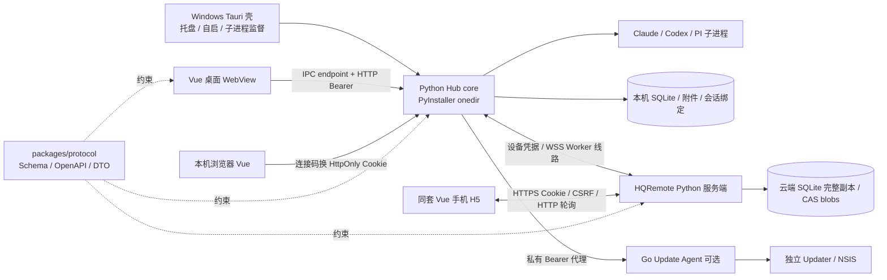

# HQAgent-Hub 项目文档

## 变更记录

| 日期 | 版本 | 变更说明 |
| --- | --- | --- |
| 2026-10-05 | v1.1 | AGENTS §7 安全红线按 WS Ticket 专用签发接口与一次性秘密专用交付修正措辞，同步 §2 鉴权边界与 §9。 |
| 2026-10-04 | v1.0 | 以 integration/phase1 `982f130` 代码为基线，归并当前产品、架构、开发交付和历史决策；区分已实现、占位与搁置范围。纯文档核对，未运行测试、模型或线上操作。 |

## 1. 产品与当前范围

HQAgent-Hub 把用户电脑上的 Agent CLI、项目和会话统一到本地控制中心，并通过 HQRemote 让手机继续对话、处理允许远程处理的审批、上传附件。**电脑是唯一执行和对话写入方，云端保存完整同步副本并转发控制命令，手机不运行模型。** 模型登录、订阅和凭据由用户在电脑上的 CLI 管理。

当前进入功能冻结期：只修 bug、优化已有体验；前端 UI/交互交由专门开发者按[前后端交接手册](前后端交接手册.md)分批优化。本轮用户明确搁置 **R2 飞书、R4、R5、PI 第二期、DSH**；名称沿用任务代号，不把旧规划当成新开工授权。通用外部插件市场、截图自动修复/APK 交付等旧 vNext 目标也不是本轮承诺。

| 范围 | 当前事实与代码入口 |
| --- | --- |
| Windows 桌面版 | Tauri 2 壳、托盘、当前用户自启、受管 Hub 子进程、NSIS 打包；`apps/desktop/src-tauri/` |
| 本地工作台 | 场景/角色、项目登记、对话/运行、明确会话续接、审批、附件、原生会话；`apps/hub/runtime/local_chat.py`、`apps/desktop/src/pages/chat/` |
| Agent | 内置 Claude、Codex、PI；实际能力按实例发现结果、guard、模型目录和验证记录判断，不能按品牌承诺；`apps/hub/adapters/builtins.py` |
| 手机远程 | 登录、设备配对/管理、对话同步/继续、允许范围内审批、原生索引与临时读取、目录登记、附件、设备管理 PAT；`apps/server/`、`apps/hub/runtime/remote/` |
| PI 一期 | 调度、RPC 保护、模型目录、图片验证与线路5投影已有代码；PI 原生 reader 第二期未实现，不能因协议有类型就显示可导入 |
| 旧管理页面 | 概览、团队、任务、会话、审批、模板仍有路由；不同于当前对话主入口。部分动作仅前端内存效果，见 §9 |
| 设置/OTA UI | `/settings`、`/updates` 都使用 `PlaceholderPage.vue`；有 Go 更新组件和 Hub 代理，不等于当前安装包已开放完整 OTA |

### 用户真实使用流程

1. 电脑安装桌面版；用当前 Windows 用户安装并登录需要的 CLI。启动桌面，发现 Agent，选择可用实例/模型，登记项目并配置场景/角色。
2. 桌面关窗隐藏到托盘；首次运行默认注册当前用户登录自启，顶部可关闭。不是 Windows 登录前服务。电脑休眠、关机、未登录或断网时手机不能发起执行。
3. 电脑进入“连接手机”，创建配对码/二维码；手机访问远程 H5，登录账号，扫码或手填8位码，先预览电脑，再确认。配对码在 URL fragment 中，读取后清除，不放查询参数。
4. 手机选电脑、项目、对话，发送文字或先上传附件再发送。默认继续原上下文；普通场景通过“+ 新话题”显式新建上下文；原生对话只能精确继续。
5. 运行、消息和审批由电脑产生并同步。高风险远程批准受限，需回电脑处理；暂停远程不停止本地运行或历史同步。离线发送立即失败并保留输入，不承诺离线排队。
6. 不再使用设备时删除设备会作废设备凭据并清除云端副本；仅“关闭窗口”不会断开后台。同步关闭、可见性、远程暂停各有不同含义，不能混用。

## 2. 架构、进程与数据



| 组件 | 责任 / 主要入口 |
| --- | --- |
| 桌面壳 | `src-tauri/src/process_supervisor.rs` 启停子进程；`runtime_descriptor.rs` 身份、存活和就绪校验；`commands.rs` IPC；`tray.rs`、`autostart.rs`、`window_state.rs` 管桌面生命周期 |
| Hub core | `runtime/main.py` 监听与启动；`runtime/composition.py` 装配；`api/app.py` v1 门面，`api/local_chat.py` v2；`storage/` SQLite 持久化；`orchestrator/`、`security/` 执行边界 |
| Vue | `src/app/router/index.ts` 路由；`stores/` 管状态；`shared/api/` 三套 gateway；桌面和远程复用组件/主题，鉴权和资源身份不同 |
| HQRemote | `apps/server/server/app.py` API；`server/` 中设备、命令、同步、副本、附件和临时查询模块；不调用 CLI、不保存模型凭据 |
| 协议 | `packages/protocol/` 定义 wire/HTTP、错误、事件与生成 DTO；业务内部模型通过 Mapper 转换 |
| OTA | `packages/updatekit/` 是仓库内独立 Go module；`apps/update-agent/product/` 产品策略与私有 API，`apps/updater/` 独立安装帮助进程；前端只能经 Hub，不连接 Update Agent |

### 数据目录与端口

| 项目 | 当前规则 |
| --- | --- |
| 安装目录 | `%LOCALAPPDATA%\Programs\HQAgent-Hub\`：桌面 exe、`core/` 的完整 onedir、`web/`；Update Agent 可选。运行期不写此目录 |
| 默认用户数据 | `%LOCALAPPDATA%\HQAgent-Hub\`：`data/`、`config/`、`runtime/`、`logs/`、`updates/`、`diagnostics/`、`worktrees/`；壳另使用 `webview/` |
| 自定义 Hub 数据根 | `--data-dir` 优先于 `HQAGENT_HUB_DATA_DIR`，再使用平台默认。macOS 为 `~/Library/Application Support/HQAgent-Hub`，Linux 为 `${XDG_DATA_HOME:-~/.local/share}/hqagent-hub`；见 `runtime/paths.py` |
| 壳配置/运行目录 | `config/desktop-shell.json`、默认根下 `runtime/`。托管模式即使 Hub 数据根指向旧目录，descriptor 仍使用壳传入的 `HQAGENT_RUNTIME_DIR` |
| 本地数据库/附件 | 由 `storage/database.py`、`runtime/attachments/library.py` 等管理；迁移/备份要包含整套数据和关联文件，不能只搬一个数据库文件 |
| 云端 | `HQREMOTE_DATA_DIR` 保存数据库、密钥文件和 `blobs/`。常用部署约定 `/opt/hqremote/app` 程序、`/var/lib/hqremote` 数据；实际值以部署配置为准 |
| Hub 监听 | 仅 `127.0.0.1`，默认 `--port 0` 随机端口；桌面托管禁止固定非零端口。本地开发可用8765；Vite 默认5173，截图工具固定5198 |
| HQRemote 监听 | 配置默认 `127.0.0.1:8080`，通过 HTTPS 反向代理；已有部署的 upstream 可以不同，不能照抄开发端口覆盖线上 |
| Update Agent | 随机 loopback 端口，独立 `runtime/update-agent.json` 与 token；不把该 endpoint 交给 Vue |

迁移旧数据时先停止所有写入同一数据根的 Hub，完整备份，优先通过 `desktop-shell.json.coreArgs` 沿用旧根；不能同时启动两套 Hub 写同一库。设备凭据受当前用户保护，跨用户复制不等于可解密。卸载保留用户数据。详细操作保留在[桌面壳 README](../apps/desktop/src-tauri/README.md)。

### 鉴权边界

- 壳验证 `hub.json` 私有 ACL、PID/进程路径、instanceId/启动时间和健康响应，IPC `get_hub_endpoint` 只给受信 WebView `{baseUrl, token}`。请求逐次重新取 endpoint，只合并同一时刻的 IPC，不跨重启缓存旧 token/端口。
- 本机浏览器用一次性连接码 `POST /api/v2/auth/local-session` 换 HttpOnly Cookie；不读取 Hub Token。本机 Cookie 和云端 Cookie 不可互换。连接码有效10分钟；浏览器会话30天滑动续期，见 `core/local_auth.py`。
- 本机 v1 HTTP 用 Bearer；v1 WS 先签发30秒、单次、绑定能力集的 Ticket，再连接 `/api/v1/events/stream`。v2 本地对话用 HTTP 轮询，**没有实现 `/ws/v2/local`**。
- 手机用云端 Cookie，写入需要 Origin、CSRF、幂等键；云端 Worker 用独立设备凭据建立 `/ws/v2/worker`。设备 PAT 只开放精确的 `devices:read/manage/delete` scope，不扩展到聊天、附件、配对或签发 PAT。
- 红线遵循 [AGENTS.md §7](../AGENTS.md#7-安全红线)：Hub Token、Update Agent Token 不进入任何响应、事件、日志或前端持久存储；WS Ticket 只由专用签发接口 `POST /api/v1/auth/ws-ticket` 返回给已鉴权调用方，此外同样不得外泄；设备配对码与 PAT 等一次性秘密只由各自专用接口交付一次，不扩散到普通 View、截图或日志；模型凭据不进云端。

## 3. 核心业务机制

### 3.1 Agent、模型、guard 与角色

`adapters/manager.py` 负责实例发现，`builtins.py` 只注册受信内置 Claude/Codex/PI。发现可执行文件、版本和能力，与运行时 health 分开；不把 PATH 的 PowerShell 函数当作 CLI。可用 `HQAGENT_CLAUDE_PATH`、`HQAGENT_CODEX_PATH`、`HQAGENT_PI_PATH` 指定真实入口，仍需通过适配器的发现/保护检查。

模型列表从实际 adapter 查询；Claude 使用 `claude_catalog.py`，Codex 经 app-server，PI 经 RPC 元数据。角色绑定精确实例与 modelId，默认模型用省略字段表示；展示标签不是模型 ID。PI 模型选择器按**第一个斜线**拆 provider 与剩余完整模型 ID，不按最后斜线拆分，不自动套用建议模型。

`claude_adapter.py`、`codex_adapter.py`、`pi_adapter.py` 实现内部 Adapter Port；会话精确绑定外部 session/thread ID，禁止 `latest` 或无关任务复用。取消区分传输丢失、进程退出与未确认结果，不能收到 abort 应答就宣布执行停止。PI 通过 `--no-extensions` 和显式加载 `resources/pi/hub-guard.mjs` 隔离自动扩展；guard 未就绪、隔离或握手不能确认时 fail-closed。公开只给安全状态，不透出保护通道密钥或调用原文。

场景/角色配置在 `runtime/local_chat.py`、`storage/local_chat.py`、`storage/local_role_templates.py`，角色解析在 `orchestrator/role_resolver.py`、`team_resolver.py`。场景角色与旧团队 `fallbackChain` 不是同一结构。角色与品牌解耦，权限绑定角色；硬能力不足明确报缺口，不把失败显示为正常完成。内置角色规范以 `packages/protocol/registry/roles.yaml` 为准。

危险操作 `deploy / git_push / git_merge / delete / shell / network / db_migrate` 必须按策略审批；授权精确到操作对象/参数、作用域、期限，不能取消路径限制。`security/paths.py` / `worktrees.py` 做路径与写入隔离；审批流见 `security/approvals.py`、`permissions.py`。非 Git 项目可登记为只读，不可借 UI 状态“初始化成功”升级权限。

### 3.2 对话、运行、会话与恢复

Conversation 是对话容器，Run 是一轮执行，Message 是用户/助手内容；Task/Node/Session 是现有执行内核身份。没有额外 Attempt 状态机：远程 commandId 是控制请求身份，不能替代 runId/taskId。场景与模型选择写入执行快照，后续编辑角色不改写历史轮次。

`sessionMode=new/continue` 是执行语义，不是 UI 文案。新话题只影响下一条已确认发送，成功后回继续；失败保留草稿和原意图。原生对话只能 continue；续接失败不得静默开新会话。本机部分运行中输入有排队显示，手机同对话 busy 拒绝；两者不是服务器离线队列。

本机持久化、事务事件、幂等和恢复入口分别见 `storage/`、`runtime/local_chat.py`、`orchestrator/recovery.py`。进程/连接重启后以已有身份对账；`recoveryRequired` 不自动证明仍占 busy，更不能自动重跑可能已有副作用的操作。

本机删除对话走 `runtime/conversation_deletion.py`：expectedVersion CAS，全部相关执行必须终结，不允许准备/恢复/取消不明时强删。删除 Hub 记录/附件和独占执行关联，保留原项目源码与 CLI 原始记录；云端清理回执可能 pending/unconfirmed，不假称已完成。手机没有对话删除入口。

### 3.3 原生会话与授权根目录

- `adapters/history.py`、`history_index.py` 和 `runtime/native/` 读取已登记项目内的原生 Claude/Codex 历史；未导入仅同步索引，原文在线临时读取，不进入云端数据库、可靠事件或缓存。
- 来源/CLI 系列与记录结构均需可识别；unknown/unsupported 默认不能读取或继续。PI 第二期 reader 尚未实现，显示 `reader_not_implemented`，协议中的 `pi.jsonl.v3.tree` 不代表功能已开放。
- 导入须 `terminalClosedConfirmed=true`、expectedIndexVersion、sourceRevision。用户确认不能覆盖明确活跃进程证据；精确原生绑定使用唯一写锁。导入本机返回201、远程返回202资源命令，都不自动启动模型；后续继续才执行。
- 原生历史按分段/分页校验后显示，不能把半段当完整回答。导入后成为 Hub native 对话，再按完整副本规则同步；不填假 scene。
- 授权根目录仅电脑 GET/PUT 管理，默认空、最多32根、版本 CAS。手机只见 rootId/显示名/版本，逐层使用电脑签发的短期不透明目录引用；不得拼接绝对路径。登记前重查真实路径、符号链接和授权。移除根撤销引用，但不注销已登记项目。
- 协议细节：[R3-contract](../packages/protocol/remote/R3-contract.md)、[PI-contract](../packages/protocol/remote/PI-contract.md)；手机的“暂不支持”是原生条目的折叠分区，不是已实现任意会话分组管理。

### 3.4 手机配对、同步与断线恢复

`runtime/remote/link.py` 管配对与连接生命周期，凭据经 `security.py` / `keychain.py` 保护；`worker.py` 管连接，`delivery.py` / `commands.py` 管命令，`sync.py` / `recovery.py` 管可靠同步。服务端实现位于 `apps/server/server/`，协议以 [R1](../packages/protocol/remote/R1-contract.md)、[R1.5](../packages/protocol/remote/R1.5-contract.md) 为准。

电脑唯一写入，手机和电脑均可继续同一对话，不需要 handover。同步默认开启；`visibility=both/pc_only/mobile_only` 是显示过滤，不决定是否上传。电脑可 includeHidden 找回隐藏对话；关闭同步、删除对话、删除设备有真正删除副本/附件的语义。

下行先暂存收件，再取得持久 grant 才可执行；ACK 不是授权。新手机提交要求在线，未 grant 的送达窗口最多30秒，超时后迟到命令不得执行；已 grant 的操作必须如实对账，不能因为控制请求超时伪造失败/取消。busy 来自电脑 queued/running/waiting_approval 的完整集合，重连重新同步，服务端不持执行锁。

可靠线路按 seq/epoch/hash 和 ACK 重放，修订切换走双向栅栏，不能重写旧帧修订或摘要。大消息分片齐全校验后才发布，backfill 有完成标志。冲突/resync 不通过清空数据库或强改版本解决。`runtime/remote/recovery.py` 只允许同步已开启、线路≥3、存储连续且无需身份对账的本机 REMOTE_SYNC_CONFLICT 冻结申请重建；必须新握手明确 commandDelivery=ready，服务器仍冻结则拒绝。获准后 sync.reset → 等reset ACK → 新generation完整backfill → 等完成ACK，保留持久阶段；不是手机刷新页面，也不是伪装online。

本机运维 CLI 在 `apps/hub` 目录运行 `../../.venv/Scripts/python.exe -m runtime.cli --data-dir <数据根> remote status`。仅明确确认清理云端副本、接受补传期间不完整后才使用同一CLI的 `remote resync --confirm-reset`；此操作不是自动重试，不绕过服务器身份冻结。本次未执行。

浏览器 serverCursor 是不透明、绑定用户与能力集的游标；过期/失效重取 snapshot 与新游标。PI 客户端统一 `X-HQ-Client-Features: pi-v1`，缺省客户端保持0.10.1投影。能力头只控制可解码字段，不授权额外访问。不可安全投影的可见状态返回410要求重建，不能静默丢失审批。手机浏览器没有云端 WS Ticket。

远程暂停只挡新业务操作，不停止同步/已有历史下载；run.cancel、审批 reject 保留豁免。`git_push/deploy/delete/db_migrate` 或 `remoteApprovalAllowed=false` 不允许远程 approve。控制请求 `confirmed/rejected/unconfirmed` 与 run 执行终态分开。

### 3.5 附件与图片能力验证

代码在 `runtime/attachments/`、`apps/server/server/` 的附件/BlobStore 模块及前端 `shared/attachments/`。图片最多10,000,000字节，文件20,000,000字节，每条5个，账号逻辑额度5,000,000,000字节；以 limits API 下发为准。raw body、SHA-256、Content-Length、编码后的文件名和幂等键共同校验；类型白名单/magic/文本内容检测，不只看扩展名。

手机先上传取得 attachmentId，再发同一对话的不可变清单；未发送24小时过期。Worker 得到 grant 后、启动 Agent 前下载核验。电脑先可靠同步带 pending_upload 清单的完整消息，再上传绑定附件、递增 messageRevision 更新 available。离线可上传、不能发送；暂停禁止手机上传，但允许电脑既有消息附件同步上传和已有附件下载。

原文件只作 attachment/no-store/nosniff 下载；图片预览仅使用受限子进程生成的缩略图，不把原始图片 URL 直接嵌入。缩略图 pending/失败不等于原文件不存在。服务端 CAS 以 hash 分层存储，同 hash 节省物理空间而不减少各记录逻辑额度；删除清零引用后才删共享 blob。备份必须协调 DB、blob 和删除墓碑。详见 [R1.6-contract](../packages/protocol/remote/R1.6-contract.md)、[服务端附件说明](../apps/server/README.md)。

图片支持需要 CLI 入口、Runtime 实现、实测记录三层同时成立。`verification_target.py` 绑定 **agentId + CLI version + 精确 modelId（含默认）+ transport + 配置指纹/targetRevision**；不跨实例、版本或模型借用成功记录。实际 transport：

| Runtime | transport |
| --- | --- |
| Claude | `stream-json-image-v1` |
| Codex | `app-server-localImage-v1` |
| PI | `pi-rpc-images-v1` |

`verification.py` 执行 `new / resume / mixed-five / cancel / error` 五项探测；`verification_jobs.py` 统一 HTTP/CLI 的异步作业和槽位。必须用户明确费用确认；查询、失败刷新、Hub 重启不自动启动收费验证。取消待确认、`slotHeld`、`executionMayStillBeRunning`、`cleanupState=unconfirmed` 都不能解锁重复收费。前端、服务端和 Hub 在发送/启动前检查所有目标角色；缺证据按 unknown/unsupported。

### 3.6 桌面存活与就绪、OTA 现状

壳把存活与就绪分开：healthz 超时2秒，每2秒检查；冷启动90秒窗口内不因存活探测失败反复杀进程，之后连续3次失败才触发重启。bootstrap 就绪请求常态15秒、冷启动30秒，2秒缓存/合并并发；仅 bootstrap 慢不触发 watchdog 重启。壳 bootstrap 也必须带 pi-v1，因为它与前端共享 Hub Token，改变能力集会使前端游标失效。

崩溃按1/2/4/8秒退避，稳定运行30秒重置。托盘退出通过 shutdown/EOF、最多15秒等待后强制结束；关窗只隐藏。前端 `DesktopConnection.vue` 恢复覆盖层保留草稿并暂时阻止交互。

OTA 公共代码目前在 `packages/updatekit/`（0.1.0、未发布），两个Go应用通过go.mod本地replace消费；尚未证明另一个产品已迁移到同一版本，不能宣称消除分叉。Go 组件已有下载、验签、排空/备份、独立 Updater 和回滚代码；签名失败无忽略入口。但当前默认打包可省略 Update Agent，`get_shell_status` 报 `missing` 不阻塞 Hub；`/updates` 仍占位。`apps/update-agent/product/server.go` 的 events 返回501；前端 `LocalHubGateway.controlUpdate` 仍指向 `/api/v1/updates/actions`，与冻结细粒度路由存在差异。完整签名 NSIS 升级/回滚是否已完成生产验收**待核实**，不能拿历史设计或组件单测当安装验收。参考[更新代理](../apps/update-agent/README.md)、[安装器](../apps/updater/README.md)、[历史 OTA 设计](OTA升级架构设计.md)。

## 4. 协议与版本

| 项目 | 基线事实 |
| --- | --- |
| 协议运行版本 | `packages/protocol/VERSION` = **0.11.1**，Hub 从生成 Python 常量导入 |
| Worker wireRevision | codecs 支持1–5：1历史线路，2完整副本/两端继续与grant，3原生/目录查询，4附件，5PI；升级需协商与栅栏，不按包版本推断连接已升级 |
| 产品版本 | 根/desktop package、Tauri、Hub APP_VERSION 当前0.1.0；与协议、数据库迁移版本独立 |
| 元数据差异 | `packages/protocol/package.json` 当前0.2.2，不是运行协议版本；后续由 W0/Integrator 统一，消费者不能自行修协议包 |

事实源为 `schema/`、`openapi/`、`registry/`、`events/`、`remote/*-contract.md`。边界 DTO 从 `generated/ts`、`generated/python`、`generated/go` 导入，禁止手写同名兼容字段或手改生成物。TS 通过 `@hqagent/protocol`，Python 通过 `protocol.generated.python`；ViewModel/UI gateway 可手写，需与 DTO 映射分离。原子 fixtures 留在协议包，前端 mock 只组合它们。

```powershell
# 仓库根；仅协议责任人实施变更时执行，本次文档整理未执行
pwsh scripts/protocol/generate.ps1
pwsh scripts/protocol/validate.ps1
pwsh scripts/protocol/validate.ps1 -CheckGenerated
python -X utf8 -B packages/protocol/remote/api-contract.py
```

本机 [v1 OpenAPI](../packages/protocol/openapi/local-hub.v1.yaml)、[v2 OpenAPI](../packages/protocol/openapi/local-chat.v2.yaml)、云端 [remote v2 OpenAPI](../packages/protocol/openapi/remote-hub.v2.yaml)、[Update Agent 私有 API](../packages/protocol/openapi/update-agent.internal.v1.yaml) 分开；两个 `/api/v2` 不是同一个服务。错误以 [error-codes.yaml](../packages/protocol/registry/error-codes.yaml) 与 [HTTP guidance](../packages/protocol/remote/http-error-guidance.yaml) 为准。

## 5. 开发、构建、验证与交付

### 5.1 建环境与启动

Windows 推荐 Python3.13、Node24、pnpm11.25.0（与当前 CI 对齐）；服务端支持 Python3.11+，Docker 基础为3.12。Rust/MSVC/WebView2 是壳构建前提。每个 worktree 自建环境，不复制别人的 `.venv` 或编译目录。

```powershell
# 仓库根
py -3.13 -m venv .venv
.venv/Scripts/python.exe -m pip install -r apps/hub/requirements.local-lock.txt
.venv/Scripts/python.exe -m pip install --no-deps -e packages/protocol -e "apps/hub[test]"
pnpm install --frozen-lockfile
pnpm dev:mock
```

连接真实本机 Hub 使用两个终端：

```powershell
# 终端1，仓库根启动；选独立开发数据目录
Push-Location apps/hub
../../.venv/Scripts/python.exe -m runtime.main --environment development --port 8765 --data-dir E:/tmp/hqagent-docs-dev
Pop-Location
# 终端2，仓库根；新浏览器配置先清除曾保存的 mock 模式（详见交接手册）
$env:VITE_GATEWAY_MODE = 'local'
pnpm dev
```

浏览器打开 `/connect`，使用该 Hub 控制台连接码；不要读取/分享 hub.json。只运行前端不等于 Hub 已启动。完整同源页面先 `pnpm build`，启动 Hub 时增加 `--web-dir <本仓库/apps/desktop/dist绝对路径>`。前端普通浏览器 v2 Cookie 主流程可联调；旧 v1 管理页不自动复用本机 Cookie，详见交接手册。

桌面开发：准备完整 Hub onedir（下一节），然后 `pnpm --dir apps/desktop exec tauri dev`，由壳发现/启动受管 Hub。打包版从托盘测试关窗、退出、自启和手机连接，不把 Vite mock 截图当真实壳验收。

### 5.2 按改动范围验证

**以下是后续开发命令，本次纯文档任务没有运行测试。** 按实际改动选相关用例；原有断言不删、不放宽。前端 worker 受限运行，不默认并发占满机器。

```powershell
pnpm --dir apps/desktop lint
pnpm --dir apps/desktop typecheck
pnpm --dir apps/desktop exec vitest run --minWorkers=1 --maxWorkers=2
pnpm --dir apps/desktop build
# 可将 vitest 范围缩为 src/stores/chat.polling.test.ts 等实际受影响文件
.venv/Scripts/python.exe -X utf8 -B -m pytest apps/hub/tests/test_cursor_scope.py -q -p no:cacheprovider
.venv/Scripts/python.exe -X utf8 -B -m pytest apps/server/tests/test_pi_projection.py -q -p no:cacheprovider
cargo test --offline --manifest-path apps/desktop/src-tauri/Cargo.toml -- --test-threads=1
go -C packages/updatekit test ./...
go -C apps/update-agent test ./...
go -C apps/updater test ./...
```

测试所需目录、Python editable 包、Go 共享模块路径等按各组件 README 准备，不把环境缺失改成跳过测试。真实模型冒烟 `scripts/e2e/local-chat-smoke.py` 会消耗所选模型额度，只在明确授权的测试数据目录使用。UI 回归场景、freezePrototype 与截图方法见交接手册。

### 5.3 Windows 安装包

```powershell
# 仓库根；前提 .venv 已有 PyInstaller 6.22.3，pnpm/cargo 依赖已准备
pwsh -NoProfile -File apps/desktop/scripts/build-windows.ps1
# 可选提供已构建更新组件，不提供时按 missing 交付
# pwsh -NoProfile -File apps/desktop/scripts/build-windows.ps1 -UpdateAgentPath <绝对exe路径>
```

脚本顺序是 `apps/hub/packaging/windows/build-core.ps1` → Vue build → Tauri NSIS。Hub 输出 `dist/hqagent-core/`（exe + `_internal`，不能只拿 exe）；桌面 exe 在 `apps/desktop/src-tauri/target/release/`，安装包在其 `bundle/nsis/`。默认 `CARGO_BUILD_JOBS=4`（4个并行编译任务），可用 `HQAGENT_CARGO_JOBS` 降低；设 Cargo offline，不自动装依赖；拒绝残留 `TAURI_CONFIG`。旧壳 README 的“单任务构建”已过期，以脚本为准。脚本输出 SHA-256，不自动等于已代码签名或已发布。

安装回归至少复现：新用户安装→启动/发现→关窗托盘→手机继续→异常 Hub 恢复→自启→卸载重装保留数据。真实 OTA 另需签名包、旧版恢复材料及程序/数据库回滚验证，不能以默认不含更新组件的包宣称完成。

### 5.4 HQRemote 部署概要

这是交付步骤，不包含服务器凭据，也不代表本次已部署。参考 [服务端 README](../apps/server/README.md)、`Dockerfile`、`Caddyfile.example`、`nginx-attachments.conf.example`。

1. 固定集成 SHA，准备单应用进程的 Python 环境或仓库 Dockerfile 镜像；应用在 `/opt/hqremote/app`，持久数据在 `/var/lib/hqremote`，以非特权专用用户运行。持久数据不随应用发布替换。
2. 按 `apps/server/requirements.txt` 安装固定依赖/同仓库协议包；打包携带 `server/resources/` 冻结规范。需要更新资源时使用 `apps/server/scripts/package_contract.py`，由协议/服务端责任人验证一致性。
3. 以受控配置设置 `HQREMOTE_ORIGIN`、`HQREMOTE_DATA_DIR`、`HQREMOTE_STATIC_DIR`、监听端口和可信代理；H5 用同套 Vue 产物。密钥文件仅服务用户可读，不写版本库、命令参数或日志。
4. 发布前备份：短暂停写，SQLite Backup API 与 blob 快照保持一致；回滚旧库前合并最新无正文删除墓碑，避免已删除内容复活。保留当前版本程序以便回退。
5. 在 `apps/server` 环境执行 `python -m server.cli migrate`；账号用 `python -m server.cli create-account --login <账号> --display-name <显示名>` 交互设置口令，无公开自注册。现有账号改密用 `set-password`，口令不进入 shell 历史。
6. HTTPS 反向代理精确 Origin，转发 `/api/v2/**`、`/ws/v2/worker` 与 H5；Worker WS 需要 upgrade。临时查询关闭代理缓存/磁盘缓冲/APM 正文采集；附件上传使用仓库专用片段，upstream 必须与实际部署一致。
7. 以服务管理器重启单进程服务，核对服务进程/监听与公开 `/api/v2/openapi.json`、Cookie 登录、配对、两端继续、断线快照恢复、附件上传下载/真删除和旧客户端投影。观察脱敏 requestId/状态/错误码，不记录请求体、秘密或真实对话。

### 5.5 CI

[ci.yml](../.github/workflows/ci.yml) 在 integration/phase1、main push、PR 与手动触发：协议重新生成校验及契约测试；Hub/Server 跨平台 pytest（PR Windows+Ubuntu，push/手动再含macOS）；Server smoke；Vue lint/typecheck/vitest/build。现有 CI 前端脚本未限制 worker，开发者本机仍按上面的1–2 worker约定；不能把 CI 通过当真实模型、安装或线上验收。

## 6. 工作方式、所有权与交付

[AGENTS.md](../AGENTS.md) 仍是开发硬规则。每条执行线独立物理 worktree、固定分支/baseCommit；禁止共享工作目录、Git Index、lockfile 或环境。当前文档线只在 `work/docs`，不修改其它 worktree，不合并 integration。

| 工作包 | 路径所有权（从旧分工 §6 迁移） |
| --- | --- |
| W0 | `packages/protocol/**`、`scripts/protocol/**`、`.hqagent/**`、AGENTS 与初始根骨架 |
| W1 | `apps/hub/core/**`、`api/**`、`storage/**`、`runtime/**`、`tests/**` 和 Hub 工程配置 |
| W2 | `apps/hub/adapters/**`、历史 Agent 适配规范 |
| W3 | `apps/hub/orchestrator/**`、`security/**` |
| W4 | `apps/desktop/**`，排除 `src-tauri/**`；本次 UI 优化再收窄为展示/交互层 |
| W5 | `apps/desktop/src-tauri/**` |
| W6 | HQUpdateKit（当前在 `packages/updatekit/**`，历史目标为独立仓库）及 `apps/update-agent/**`、`apps/updater/**`；其它产品迁移另设 worktree |
| W7 | `packaging/**`、`build/**`、`scripts/build/**`、`scripts/release/**`、`scripts/e2e/**` |
| 新增服务端等批次 | `apps/server/**` 等以该批次任务书/handoff 划分；原 W 表不自动给任何包新增所有权 |
| Integrator | 根 package/workspace/lockfile、CI、跨包 Composition Root；其它包需交 handoff |

这张表继承路径边界，不承诺所有历史规划目录已存在。跨路径变更写 `.hqagent/handoffs/`：问题、代码证据、影响端、建议契约、兼容性/fixtures、验证命令及 owner。协议仅 W0 可写；新增/删除/重命名/语义变更先评审，破坏性变更由产品负责人确认，重新生成三端并记录版本/SHA，再通知消费者。

历史 FZ-1（HTTP/鉴权/descriptor等）、FZ-2（Adapter/Session/能力）是**契约冻结**，RD-1（Hub就绪）、RD-2（执行闭环）是**实现证据**；不要用冻结记录宣称现在已可用。历史记录见 [.hqagent/INTERFACES.md](../.hqagent/INTERFACES.md)，后续 wire 冻结以协议与对应 handoff 为准。

合并进入 `integration/phase1`，不直接推 main；提交信息/PR/tag 只描述改动，无 AI 署名、Co-Authored-By 或 Generated with。每次提交后 `git log -1 --format=%B` 自查。交付必须含真实 diff、命令原始输出、可复现场景、缺口及 SHA；环境故障如实标注。纯文档任务可仅做路径/引用/范围/格式静态检查，不能称已跑测试。

## 7. 仍有效的重要决策

完整背景见 [.hqagent/DECISIONS.md](../.hqagent/DECISIONS.md)。此表按最终有效结论阅读，不逐条照搬早期阶段范围。

| 决策 | 当前适用结论 |
| --- | --- |
| D1–D3、D6、D8、D10 | Hub 统一本机入口；Python onedir；程序/数据分离、当前用户 NSIS；隔离 worktree；OTA 接线缺口见 §3.6 |
| D7、D17–D22、D25、D29 | 精确会话血缘；两段式取消；传输断开与退出不同；Hub 管审批时效；能力检测与健康分开；路径前后检查 |
| D11、D12、D24 | 线上 camelCase、枚举 snake_case；仓库生成器和 VERSION 是协议事实源 |
| D40、D41 | 不引入 Attempt；控制回执与执行状态分离，unconfirmed 不等于已停止 |
| D43–D48 | 本机可管理配对，v2 Cookie 等价入口；快照含 pending 审批；二维码 fragment；电脑唯一写入、两端继续；**D48 撤销 D43 本机只读和旧离线排队设想** |
| D49、D50 | 旧 wire 错误值域独立冻结；删除设备真删副本；暂停远程不等于断开；PAT 最小 scope/一次性秘密 |
| D51及补充 | 原生索引/临时正文/确认导入、授权根 CAS；本机独立使用；远程同步关闭的已归属原生读取返回 REMOTE_SYNC_DISABLED |
| D52及补充 | 附件线路4、暂停上传边界、图片实测绑定、本机收费验证作业与删除对话 |
| D53及0.11.1补充 | PI 线路5、guard、第一斜线模型 ID、pi-v1 兼容投影；非PI审批仍兼容旧浏览器；PI原生第二期未实施 |

D14“唯一免鉴权端点”等早期措辞仅说明当时 v1 边界；现在还有本机连接码/状态以及云端认证/公开规范路由，必须按各服务现有认证依赖判断，不能套用成全仓库规则。

## 8. 文档索引与历史查阅

| 文档 | 用途 |
| --- | --- |
| [项目文档](项目文档.md) | 当前范围、架构、机制、构建交付和开发规则入口 |
| [前后端交接手册](前后端交接手册.md) | 页面/接口地图、状态不变量、UI规范建议、审计待办与回归 |
| [精选截图清单](assets/ui/selection.json)、[工具目录](assets/ui/tools/) | 58张 mock 原尺寸图及全量重生成工具，操作方法在交接手册 |
| [施工方案](施工方案.md) | **历史设计/参考**；协议包仍引用，保留；一期“远程未做”等范围已过期 |
| [Agent适配接入规范](Agent适配接入规范.md) | **历史设计/参考**；协议 Adapter 契约仍引用；具体适配以当前 adapter/PI契约为准 |
| [OTA升级架构设计](OTA升级架构设计.md) | **历史设计/参考**；协议事件与更新契约仍引用，不代表现有安装包具备完整OTA |
| [根 README](../README.md)、[Hub README](../apps/hub/README.md)、[Server README](../apps/server/README.md)、[壳 README](../apps/desktop/src-tauri/README.md) | 组件入口和详细环境说明；阶段性描述与代码冲突时按本基线代码核对 |
| [协议包 README](../packages/protocol/README.md)、`remote/*-contract.md` | 接口语义与冻结规则，只有W0维护 |
| [.hqagent/ARCHITECTURE.md](../.hqagent/ARCHITECTURE.md)、[决策](../.hqagent/DECISIONS.md)、[reviews](../.hqagent/reviews/)、[handoffs](../.hqagent/handoffs/) | 只读设计/验收历史，含旧阶段目标；不是另一套当前产品规格 |

旧前端方案、分工方案、壳选型以及 vNext 文档的当前有效内容已并入这两份文档；旧任务话术、排期、被取代的规划/示例不再作为开发入口。`docs/vnext/examples/contracts.json` 只有旧设计/历史评审文字引用，未被代码或测试消费，随旧草案删除。查基线原文可用 `git show 982f130:docs/vnext/技术方案.md`；历史参考文档与只读 .hqagent 中指向已删除草案的文字按该 SHA 查阅，不修改协议/历史证据来伪造连续性。

## 9. 已知问题与后续项

| 项目 | 证据与下一步 |
| --- | --- |
| UI 高优先问题 | 原审计基线9b0bb75：无选中对话仍可点发送无反馈、手机侧栏焦点泄漏、危险确认缺对象、允许远程批准的操作缺二次确认。详见交接手册 H01–H04；本轮仅整理，未修复 |
| 旧页面内存动作 | `stores/agent.store.ts:toggleAgent` 只改本地 status；`workspace.store.ts:removeWorkspace/initMemoryDir/setWorkspaceProfile` 只改内存，addWorkspace 也构造本地条目。S01/S02需单独核定入口职责，不能宣称后台/磁盘已改变 |
| OTA接线/验收 | events 501、更新页占位、gateway `/updates/actions` 路由差异、默认包可缺 Update Agent；参见 §3.6，未确认闭环前保持不可用说明 |
| 协议包元数据版本 | npm 协议元数据（0.2.2）滞后于运行协议版本（0.11.1），由 W0 统一；AGENTS §7 票据措辞已于 2026-10-05 按专用签发接口修正 |
| PI 原生第二期 | adapter/guard一期不等于原生reader实现；保持 unsupported/reader_not_implemented；用户已搁置 |
| 真机与安装验证 | UI审计只用mock Chromium；手机软键盘、安全区、真实相机/微信浏览器、读屏、低端机、弱网及Tauri均需实际环境验收，不能从截图推断通过 |
| 用户搁置范围 | R2飞书、R4、R5、PI第二期、DSH，不自动纳入UI优化或协议修复 |
